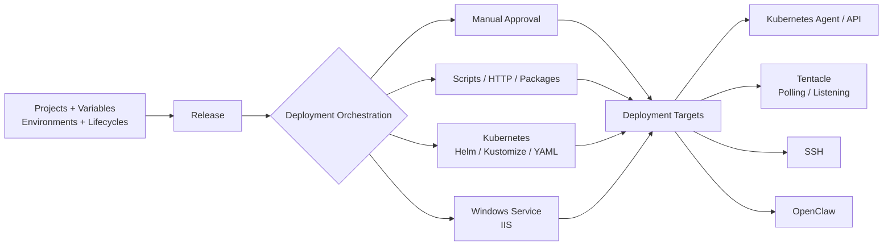
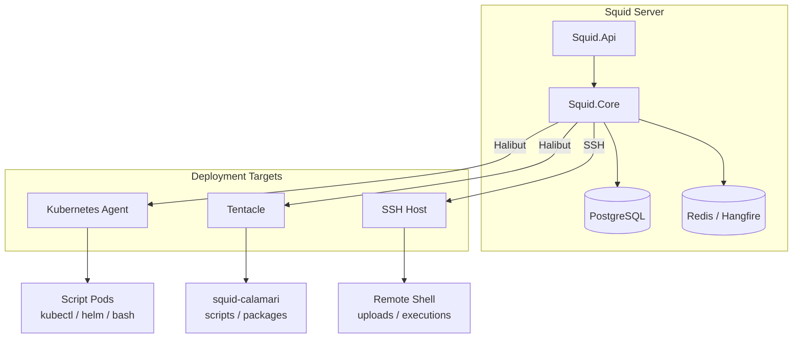

# Squid

[中文](README.md) | [English](README.en.md)

> **The free, self-hosted alternative to Octopus Deploy.**
> Use one clear release workflow to deploy applications, Kubernetes workloads, Windows Services, and scripts to any target.

[](https://dotnet.microsoft.com/)
[](https://www.postgresql.org/)
[](#migrating-from-octopus)
[](#license)

---

## Why Squid

Squid is a self-hosted deployment platform for modern delivery teams. It covers projects, environments, lifecycles, variables, releases, deployment targets, approvals, and audit history. It keeps the delivery model Octopus users already understand while offering **software pricing with no project limit, target limit, or user-seat limit**.

| What matters most | Squid | Octopus Deploy |
|---|---:|---:|
| Software cost | **Free self-hosted** | Tiered by project count and edition |
| Project count | **Unlimited** | Free: 10 projects; Professional starts at 20 |
| Deployment targets / nodes | **Unlimited** | Priced by plan and usage model |
| User seats | **Unlimited** | Free: 10 users; paid plans are unlimited |
| Octopus project migration | **Built-in Octopus import** | Native |
| Self-hosting | **Fully supported** | Server: supported; Cloud: not self-hosted |
| Kubernetes Agent / API | **Supported** | Supported |
| SSH / Windows Tentacle | **Supported** | Supported |

> Octopus pricing is included only as a public reference from `octopus.com/pricing` (2026-09-28). Actual prices and entitlements are governed by the Octopus website. Squid does not claim exact feature parity with every commercial Octopus capability. See [Limitations](#limitations) for the current differences.

## At a Glance



**Core capabilities**

| Area | Capabilities |
|---|---|
| Delivery model | Spaces, project groups, projects, environments, lifecycles, channels, releases, deployment history |
| Deployment orchestration | Step conditions, parallel steps, delayed starts, target roles, environment/channel filters, timeouts, and retries |
| Variables | Variable scopes, sensitive variables, variable snapshots, output variables, and configuration variable replacement |
| Security and governance | JWT / API keys, RBAC, permission scopes, teams, audit events, and manual approvals |
| Execution | Bash, PowerShell, Python, C#, HTTP, package deployment, health checks, and rollback |
| Cloud native | Kubernetes Agent / API, kubectl, Helm, Kustomize, and native Kubernetes resources |
| Platforms | Windows, Linux, Docker, and Kubernetes |
| Migration | Octopus export upload, preview, validation, and confirmed import |

## Squid vs Octopus

### Pricing Model

```text
Octopus Free
  10 projects  |  10 users
  Upgrade required beyond the free limits

Octopus Professional
  20 projects  |  USD 4,330 / year
  Price increases with project count

Squid
  unlimited projects  |  unlimited users  |  unlimited targets
  Self-hosted          |  Free software
```

> "Free" means Squid does not charge for the software itself by project count, user count, or deployment target count. The operator is responsible for the infrastructure and operational cost of running Squid, including servers, PostgreSQL, Redis, object storage, networking, and maintenance.

### Feature Comparison

| Capability | Squid | Octopus Deploy |
|---|:---:|:---:|
| Self-hosting | Yes | Yes (Server) |
| Projects / environments / lifecycles | Yes | Yes |
| Releases and deployment history | Yes | Yes |
| Variable scopes and sensitive variables | Yes | Yes |
| Kubernetes Agent | Yes | Yes |
| Kubernetes API | Yes | Yes |
| Helm / Kustomize / YAML | Yes | Yes |
| SSH targets | Yes | Yes |
| Windows Tentacle | Yes | Yes |
| Windows Service / IIS | Yes | Yes |
| Manual approvals | Yes | Yes |
| RBAC / API keys / audit | Yes | Yes |
| Octopus project import | Yes | Native |
| Tenant model | Partial | Yes |
| Tenant tag filtering | No | Yes |
| Global deployment freezes | Partial | Yes |
| SIEM audit streaming | Partial | Yes |
| Hosted cloud service | No (self-hosted) | Yes |

**The takeaway:** if you want to keep an Octopus-style release model while removing tiered limits on projects, users, and deployment targets, Squid is worth evaluating.

## Supported Deployment Targets

| Target | Communication | Best For | Main Capabilities |
|---|---|---|---|
| Kubernetes Agent | Long-lived Halibut connection | In-cluster execution and restricted networks | kubectl, Helm, Kustomize, and native resources |
| Kubernetes API | Direct connection from the server | Quickly connecting an existing cluster | kubectl, Helm, Kustomize, and native resources |
| Tentacle Polling | Agent-initiated outbound connection | Internal networks and restrictive firewalls | Scripts, packages, Windows Service, and IIS |
| Tentacle Listening | Server-initiated connection | Targets reachable on a fixed port | Scripts, packages, Windows Service, and IIS |
| SSH | SSH / SFTP | Linux hosts without an installed agent | Bash, PowerShell, Python, and package upload |
| OpenClaw | HTTP API | Agent tool calls and automation | Tools, agents, waits, assertions, and result extraction |

## Execution Architecture



## Migrating From Octopus

Squid includes a backend import workflow, so you do not have to rebuild every project by hand.

```text
Upload -> Extract -> Preview -> Validate -> Confirm -> Succeeded
```

| Stage | Purpose |
|---|---|
| Upload | Upload an Octopus export archive or JSON file |
| Extract | Safely extract files, classify resources, and build the dependency graph |
| Preview | Show resources that will be created, reused, skipped, or blocked |
| Validate | Check conflicts, missing references, credentials, and targets |
| Confirm | Create Squid resources inside a transaction |
| Status | Inspect results, mappings, and diagnostics |

**Current import scope**

- Imports current deployable configuration: projects, project groups, environments, lifecycles, channels, variables, deployment processes, steps, feeds, selected accounts, Tentacles, and certificates.
- Maps common Octopus actions to Squid actions, including Kubernetes Containers, Ingress, Script, Manual, IIS, and Windows Service.
- Does not import releases, deployments, server tasks, or historical snapshots. They are detected and reported as out of scope.
- Imports sensitive variables with empty values and marks them as required input. Feed, account, certificate, and target secrets are never silently recovered from the export.
- Skips unsupported actions or creates disabled, redacted placeholder actions.

Detailed API and limitations: [`docs/octopus-import-api.md`](docs/octopus-import-api.md)

## Quick Start

### Requirements

| Component | Requirement |
|---|---|
| Squid Server | .NET 9 / Docker |
| Database | PostgreSQL |
| Background jobs and distributed locks | Redis |
| Source build | .NET SDK 9 |

### Run Locally

```bash
git clone https://github.com/SolarifyDev/Squid.git
cd Squid

# Start PostgreSQL and Redis first, then update these values for your environment:
#   SquidStore:ConnectionString
#   RedisCacheConnectionString
#   Security:VariableEncryption:MasterKey
#   SelfCert:Base64 / SelfCert:Password

dotnet run --project src/Squid.Api
```

After startup:

- API / Swagger: `https://localhost:7078/swagger`
- HTTP: `http://localhost:5078`
- Halibut polling: `10943`

> Production deployments must replace the development certificate, JWT key, database password, and variable encryption master key.

### Docker

```bash
docker build -f Dockerfile.Api -t squid-api .
docker run --rm -p 8080:8080 -p 10943:10943 squid-api
```

For a real deployment, inject PostgreSQL, Redis, certificate, and encryption settings through environment variables or a secret manager.

### Install Tentacle

Linux:

```bash
curl -fsSL https://raw.githubusercontent.com/SolarifyDev/Squid/main/deploy/scripts/install-tentacle.sh | bash
```

Windows PowerShell:

```powershell
irm https://raw.githubusercontent.com/SolarifyDev/Squid/main/deploy/scripts/install-tentacle.ps1 | iex
```

Deploy the Kubernetes Agent:

```bash
helm upgrade --install squid-agent deploy/helm/kubernetes-agent
```

## Repository Layout

```text
Squid/
|-- src/
|   |-- Squid.Api/                  # HTTP API, auth, controllers, Hangfire
|   |-- Squid.Core/                 # Deployment domain, execution engine, import, persistence
|   |-- Squid.Message/              # Commands, events, DTOs, cross-process contracts
|   |-- Squid.Tentacle/             # Linux / Windows agent
|   |-- Squid.Tentacle.Watchdog/    # Kubernetes Agent watchdog
|   `-- Squid.Calamari/             # Script, package, configuration, and K8s executor
|-- deploy/
|   |-- helm/kubernetes-agent/      # Kubernetes Agent Helm chart
|   |-- docker/linux-tentacle/      # Linux Tentacle Compose
|   `-- scripts/                    # Linux / Windows install scripts
|-- docs/                           # Architecture, API, installation, and operations docs
|-- samples/                        # Windows Service / NuGet feed samples
`-- tests/                          # Unit, integration, and E2E tests
```

## Tests

```bash
dotnet test Squid.sln
```

The test suite covers domain logic, the deployment pipeline, Octopus import, Kubernetes, SSH, Tentacle, Calamari, Windows Service, and end-to-end scenarios.

## Documentation

| Document | Contents |
|---|---|
| [`docs/deployment-pipeline-architecture.md`](docs/deployment-pipeline-architecture.md) | Full deployment pipeline architecture |
| [`docs/k8s-deployment-architecture.md`](docs/k8s-deployment-architecture.md) | Kubernetes deployment architecture |
| [`docs/octopus-import-api.md`](docs/octopus-import-api.md) | Octopus import API |
| [`docs/windows-tentacle-install.md`](docs/windows-tentacle-install.md) | Windows Tentacle installation and troubleshooting |
| [`docs/api-key-permissions.md`](docs/api-key-permissions.md) | API key and permission model |
| [`docs/tentacle-self-upgrade-design.md`](docs/tentacle-self-upgrade-design.md) | Tentacle self-upgrade design |
| [`CLAUDE.md`](CLAUDE.md) | Developer architecture reference |

## Limitations

Squid aims to cover the majority of application and Kubernetes delivery scenarios. It does not attempt to clone every commercial Octopus capability. Current major differences:

- The tenant model and tenant tag filtering are incomplete.
- Octopus import focuses on current deployable configuration and does not migrate historical releases, deployments, or server tasks.
- Sensitive values are not recovered from Octopus exports and must be entered again in Squid.
- Squid does not provide an official hosted cloud service. Production deployments are self-hosted.
- Enterprise governance capabilities such as global deployment freezes and SIEM audit streaming do not yet reach full Octopus parity.

## License

This repository does not currently contain a standalone `LICENSE` file. The applicable terms for Squid are governed by the repository, release notes, or the formal licensing terms provided by the project owner. Confirm the licensing scope with the maintainers before using Squid in production.

## Contributing

Issues, pull requests, deployment scenarios, and documentation improvements are welcome. When adding a new execution target, action, or import mapping, follow the existing Transport, Intent, Handler, Mediator, and test patterns.
