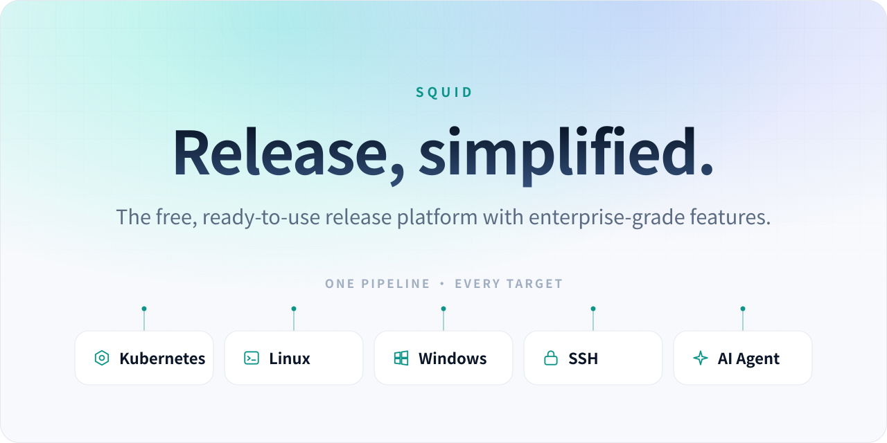
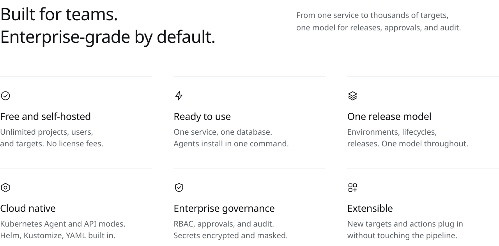
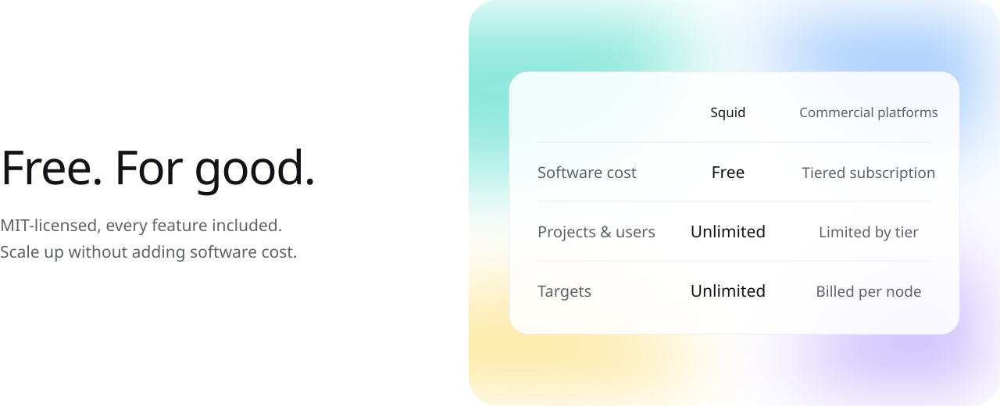

<div align="center">

<picture>
  <source media="(prefers-color-scheme: dark)" srcset="branding/squid-wordmark-reverse.png">
  
</picture>

<br><br>

<picture>
  <source media="(prefers-color-scheme: dark)" srcset="branding/readme/hero-en-dark.svg">
  
</picture>

<br><br>

<a href="#quick-start"><b>Quick start</b></a>
&nbsp;&nbsp;·&nbsp;&nbsp;
<a href="#documentation"><b>Docs</b></a>
&nbsp;&nbsp;·&nbsp;&nbsp;
<a href="#migrating-from-octopus"><b>Migrate from Octopus</b></a>
&nbsp;&nbsp;·&nbsp;&nbsp;
<a href="README.md"><b>简体中文</b></a>

<br><br>

[](https://github.com/SolarifyDev/Squid/actions/workflows/tests.yml)
[](LICENSE)

</div>

<br>

<picture>
  <source media="(prefers-color-scheme: dark)" srcset="branding/readme/features-en-dark.svg">
  
</picture>

<br><br>

<picture>
  <source media="(prefers-color-scheme: dark)" srcset="branding/readme/free-en-dark.svg">
  
</picture>

<br>

## Quick start

**Run the server** (requires PostgreSQL and Redis)

```bash
docker build -f Dockerfile.Api -t squid-api .
docker run --rm -p 8080:8080 -p 10943:10943 squid-api
```

**Connect a target**

```bash
# Linux Tentacle
curl -fsSL https://raw.githubusercontent.com/SolarifyDev/Squid/main/deploy/scripts/install-tentacle.sh | bash

# Kubernetes Agent
helm upgrade --install squid-agent deploy/helm/kubernetes-agent
```

```powershell
# Windows Tentacle
irm https://raw.githubusercontent.com/SolarifyDev/Squid/main/deploy/scripts/install-tentacle.ps1 | iex
```

> In production, inject database, certificate, and encryption-key settings through environment variables or a secret manager.

## Migrating from Octopus

Upload an Octopus export, preview and validate it, then import projects, environments, variables, and deployment processes in one step. Sensitive values are never restored from the export and must be re-entered in Squid.

## Documentation

[Deployment pipeline](docs/deployment-pipeline-architecture.md) · [Kubernetes](docs/k8s-deployment-architecture.md) · [Windows Tentacle](docs/windows-tentacle-install.md) · [Permissions](docs/api-key-permissions.md)

<br>

<div align="center"><sub>Open source under the <a href="LICENSE">MIT License</a></sub></div>
