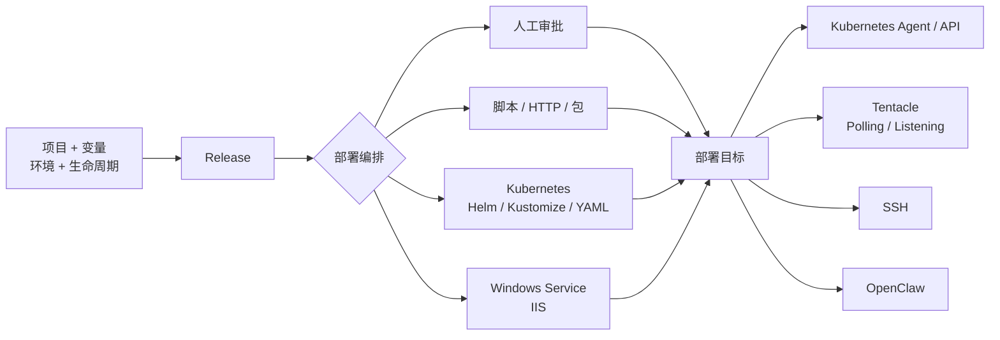
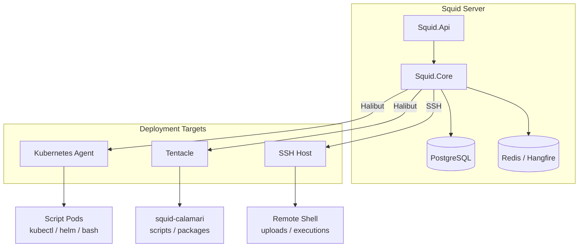

# Squid

[中文](README.md) | [English](README.en.md)

> **Octopus Deploy 的免费、自托管替代方案。**
> 用一套清晰的发布流程，把应用、Kubernetes、Windows Service 和脚本部署到任意目标。

[](https://dotnet.microsoft.com/)
[](https://www.postgresql.org/)
[](#从-octopus-迁移)
[](#许可证)

---

## 为什么选择 Squid

Squid 是一个面向现代交付团队的自托管部署平台：项目、环境、生命周期、变量、发布、部署目标、审批与审计，一个都不少。它保留 Octopus 用户熟悉的交付模型，同时提供**无项目数、无节点数、无用户席位的软件收费**。

| 你最关心的事 | Squid | Octopus Deploy |
|---|---:|---:|
| 软件费用 | **免费自托管** | 按项目和版本分级收费 |
| 项目数量 | **不限制** | 免费版 10 个项目；Professional 从 20 个项目起 |
| 部署目标 / 节点 | **不限制** | 随项目档位和使用方式定价 |
| 用户席位 | **不限制** | 免费版 10 个用户；付费版不限用户 |
| Octopus 项目迁移 | **内置 Octopus 导入** | 原生 |
| 私有化部署 | **完整支持** | Server：支持；Cloud：不支持自托管 |
| Kubernetes Agent / API | **支持** | 支持 |
| SSH / Windows Tentacle | **支持** | 支持 |

> Octopus 价格仅作公开资料对比，参考 `octopus.com/pricing`（2026-09-28）；实际价格和权益以 Octopus 官方页面为准。Squid 不承诺与 Octopus 所有商业版功能逐项完全等价，差异见[能力边界](#能力边界)。

## 一眼看懂



**核心能力**

| 领域 | 能力 |
|---|---|
| 交付模型 | Spaces、项目组、项目、环境、生命周期、Channel、Release、部署历史 |
| 部署编排 | 步骤条件、并行步骤、延迟启动、目标角色、环境/Channel 过滤、超时与重试 |
| 变量系统 | 变量作用域、敏感变量、变量快照、输出变量、配置变量替换 |
| 安全与治理 | JWT / API Key、RBAC、权限范围、团队、审计事件、人工审批 |
| 执行能力 | Bash、PowerShell、Python、C#、HTTP、包部署、健康检查、回滚 |
| 云原生 | Kubernetes Agent / API、kubectl、Helm、Kustomize、原生 K8s 资源 |
| 平台 | Windows、Linux、Docker、Kubernetes |
| 迁移 | Octopus 导出文件上传、预览、校验、确认导入 |

## 对比 Octopus

### 收费方式

```text
Octopus Free
  10 projects  |  10 users
  超出后需要升级

Octopus Professional
  20 projects  |  US$4,330 / year
  项目越多，价格越高

Squid
  ∞ projects  |  ∞ users  |  ∞ targets
  Self-hosted  |  软件免费
```

> 这里的“免费”指 Squid 自身的软件授权与使用不按项目、用户或部署目标收费。运行 Squid 所需的服务器、PostgreSQL、Redis、对象存储、网络与运维成本由部署方承担。

### 功能对比

| 能力 | Squid | Octopus Deploy |
|---|:---:|:---:|
| 自托管 | Yes | Yes（Server） |
| 项目 / 环境 / 生命周期 | Yes | Yes |
| Release 与部署历史 | Yes | Yes |
| 变量作用域与敏感变量 | Yes | Yes |
| Kubernetes Agent | Yes | Yes |
| Kubernetes API | Yes | Yes |
| Helm / Kustomize / YAML | Yes | Yes |
| SSH 目标 | Yes | Yes |
| Windows Tentacle | Yes | Yes |
| Windows Service / IIS | Yes | Yes |
| 人工审批 | Yes | Yes |
| RBAC / API Key / 审计 | Yes | Yes |
| Octopus 项目导入 | Yes | Native |
| Tenant（租户）模型 | Partial | Yes |
| Tenant 标签过滤 | No | Yes |
| 全球部署冻结 | Partial | Yes |
| SIEM 审计流 | Partial | Yes |
| 托管云服务 | No（自托管） | Yes |

**结论很直接：** 如果你希望保留 Octopus 式的发布模型，同时摆脱项目数、用户数和目标节点数的阶梯计费，Squid 值得评估。

## 支持的部署目标

| 目标 | 通信方式 | 适合场景 | 主要能力 |
|---|---|---|---|
| Kubernetes Agent | Halibut 长连接 | 集群内执行、网络受限环境 | kubectl、Helm、Kustomize、原生资源 |
| Kubernetes API | 服务端直连 | 快速接入已有集群 | kubectl、Helm、Kustomize、原生资源 |
| Tentacle Polling | Agent 主动外连 | 内网、防火墙严格的生产环境 | 脚本、包、Windows Service、IIS |
| Tentacle Listening | 服务端主动连接 | 固定端口可达的目标 | 脚本、包、Windows Service、IIS |
| SSH | SSH / SFTP | Linux 主机、无需安装 Agent | Bash、PowerShell、Python、包上传 |
| OpenClaw | HTTP API | Agent 工具调用与自动化 | 工具、Agent、等待、断言、结果提取 |

## 执行架构



## 从 Octopus 迁移

Squid 内置后端导入流程，不需要手工重建每一个项目。

```text
Upload -> Extract -> Preview -> Validate -> Confirm -> Succeeded
```

| 阶段 | 作用 |
|---|---|
| Upload | 上传 Octopus 导出文件或 JSON |
| Extract | 安全解压、识别资源、构建依赖图 |
| Preview | 展示将创建、复用、跳过或阻止的资源 |
| Validate | 检查冲突、缺失引用、凭据与目标 |
| Confirm | 在事务中创建 Squid 资源 |
| Status | 查看结果、映射与诊断 |

**当前导入重点**

- 导入当前可部署配置：项目、项目组、环境、生命周期、Channel、变量、部署流程、步骤、Feeds、部分账户、Tentacle、证书。
- 自动映射常见 Octopus Action 到 Squid Action，例如 Kubernetes Containers、Ingress、Script、Manual、IIS、Windows Service。
- 不导入 Release、Deployment、Server Task 和历史快照；它们会被识别并报告为超出范围。
- 敏感变量以空值导入并标记为待填写；Feed、账户、证书和目标密钥不会从导出文件静默恢复。
- 不支持的动作会跳过，或创建为禁用且已脱敏的占位动作。

## 快速开始

### 运行条件

| 组件 | 要求 |
|---|---|
| Squid Server | .NET 9 / Docker |
| 数据库 | PostgreSQL |
| 后台任务与分布式锁 | Redis |
| 构建源码 | .NET SDK 9 |

### 本地运行

```bash
git clone https://github.com/SolarifyDev/Squid.git
cd Squid

# 先启动 PostgreSQL 和 Redis，再按你的环境修改：
#   SquidStore:ConnectionString
#   RedisCacheConnectionString
#   Security:VariableEncryption:MasterKey
#   SelfCert:Base64 / SelfCert:Password

dotnet run --project src/Squid.Api
```

启动后：

- API / Swagger：`https://localhost:7078/swagger`
- HTTP：`http://localhost:5078`
- Halibut Polling：`10943`

> 生产环境必须替换开发证书、JWT 密钥、数据库密码和变量加密主密钥。

### Docker

```bash
docker build -f Dockerfile.Api -t squid-api .
docker run --rm -p 8080:8080 -p 10943:10943 squid-api
```

实际部署时，请通过环境变量或密钥管理系统注入 PostgreSQL、Redis、证书和加密密钥配置。

### 安装 Tentacle

Linux：

```bash
curl -fsSL https://raw.githubusercontent.com/SolarifyDev/Squid/main/deploy/scripts/install-tentacle.sh | bash
```

Windows PowerShell：

```powershell
irm https://raw.githubusercontent.com/SolarifyDev/Squid/main/deploy/scripts/install-tentacle.ps1 | iex
```

部署 Kubernetes Agent：

```bash
helm upgrade --install squid-agent deploy/helm/kubernetes-agent
```

## 项目结构

```text
Squid/
├── src/
│   ├── Squid.Api/                  # HTTP API、认证、控制器、Hangfire
│   ├── Squid.Core/                 # 部署领域、执行引擎、导入、持久化
│   ├── Squid.Message/              # 命令、事件、DTO、跨进程契约
│   ├── Squid.Tentacle/             # Linux / Windows Agent
│   ├── Squid.Tentacle.Watchdog/    # Kubernetes Agent 看门狗
│   └── Squid.Calamari/             # 脚本、包、配置与 K8s 执行器
├── deploy/
│   ├── helm/kubernetes-agent/      # Kubernetes Agent Helm Chart
│   ├── docker/linux-tentacle/      # Linux Tentacle Compose
│   └── scripts/                    # Linux / Windows 安装脚本
├── docs/                           # 架构、API、安装与运维文档
├── samples/                        # Windows Service / NuGet Feed 示例
└── tests/                          # Unit、Integration、E2E 测试
```

## 测试

```bash
dotnet test Squid.sln
```

测试覆盖领域逻辑、部署流水线、Octopus 导入、Kubernetes、SSH、Tentacle、Calamari、Windows Service 与端到端场景。

## 文档

| 文档 | 内容 |
|---|---|
| [`docs/deployment-pipeline-architecture.md`](docs/deployment-pipeline-architecture.md) | 完整部署流水线架构 |
| [`docs/k8s-deployment-architecture.md`](docs/k8s-deployment-architecture.md) | Kubernetes 部署架构 |
| [`docs/windows-tentacle-install.md`](docs/windows-tentacle-install.md) | Windows Tentacle 安装与排障 |
| [`docs/api-key-permissions.md`](docs/api-key-permissions.md) | API Key 与权限模型 |
| [`docs/tentacle-self-upgrade-design.md`](docs/tentacle-self-upgrade-design.md) | Tentacle 自升级设计 |
| [`CLAUDE.md`](CLAUDE.md) | 开发者架构参考 |

## 能力边界

Squid 的目标是覆盖绝大多数应用与 Kubernetes 交付场景，而不是逐项复制 Octopus 的全部商业能力。当前主要差异：

- Tenant 模型和 Tenant 标签过滤不完整。
- Octopus 导入以“当前可部署配置”为主，不迁移历史 Release、Deployment 和 Server Task。
- 敏感值不会从 Octopus 导出文件恢复，需要在 Squid 中重新录入。
- 不提供 Squid 官方托管云，生产环境由使用者自托管。
- 全球部署冻结、SIEM 审计流等企业治理能力尚未达到 Octopus 的完整对等程度。

## 许可证

仓库当前未包含独立的 `LICENSE` 文件。Squid 的软件使用条款以仓库、发行说明或项目所有方提供的正式授权说明为准；在正式用于生产前，请向维护方确认授权范围。

## 参与贡献

欢迎提交 Issue、Pull Request、部署场景与文档改进。新增执行目标、Action 或导入映射时，请优先遵循现有 Transport、Intent、Handler、Mediator 与测试模式。
