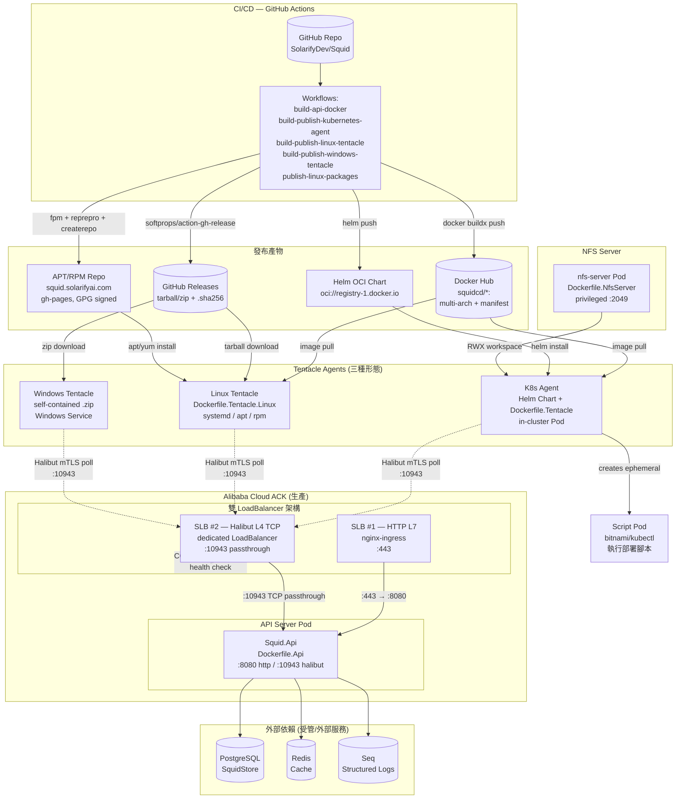

# Squid Deployment架構深度分析報告

> 本報告合成自 `docs/deployment-analysis/` 目錄下六份已完成之子分析文件（Dockerfiles、部署腳本與K8s資源、Docker Compose、CI/CD Pipeline、基礎設施與網路拓撲、外部依賴映射）。第七份《安全與可觀測性分析》因API配額限制未能完成，相關發現係從前六份中散見提取並整合於「安全與可觀測性」一節。各子分析之連結見[附錄](#附錄)。

---

## 執行摘要 (Executive Summary)

Squid 是一套自研的部署自動化系統，其整體部署架構由三類核心元件組成：

- **API Server** — 部署協調中樞，運行於 Alibaba Cloud ACK（Kubernetes）之上，透過 nginx-ingress 對外提供 HTTP/HTTPS Web API，並透過專用 LoadBalancer 暴露 Halibut 輪詢端點。
- **Tentacle Agent** — 部署執行代理，具備三種部署形態：
  - **K8s Agent**（`Dockerfile.Tentacle` + Helm Chart）— 部署於叢集內，以 Pod 形態輪詢 Server，並產生臨時 Script Pod 執行 kubectl/helm/bash。
  - **Linux Tentacle**（`Dockerfile.Tentacle.Linux`）— 自包含二進位，透過 systemd 服務或 APT/RPM 套件部署於裸機/VM。
  - **Windows Tentacle** — 自包含 .zip，透過 Windows Service 安裝。
- **NFS Server**（`Dockerfile.NfsServer`）— 為 K8s Agent 提供 ReadWriteMany 工作區共享儲存。

生產環境部署於 Alibaba Cloud ACK，API Server 與 Tentacle 之間採用 **Halibut mTLS 二進位協議**通訊（L4 TCP，埠 10943）。CI/CD 全鏈路運行於 **GitHub Actions**，產物分散發布至四個管道：Docker Hub（多架構映像 + OCI Helm Chart）、GitHub Releases（自包含 tarball/zip + .sha256 旁車檔）、APT/RPM 套件庫（gh-pages 分支，GPG 簽署）。

### 關鍵發現

1. **多架構 + 自包含為一等公民**：所有映像與二進位皆同時支援 amd64/arm64，Linux 額外區分 glibc/musl；.NET 9 `PublishSingleFile` 自包含消除了對目標機 .NET runtime 的依賴。
2. **產物來源可追溯性強**：每個映像烙印 `org.opencontainers.image.revision` commit SHA，CI 建置後立即 `docker pull` 回驗 SHA 標籤，防堵 stale image 推送（1.3.2 事故的根因修復）。
3. **雙 LB 網路約束為硬性架構限制**：HTTP（L7 nginx-ingress）與 Halibut（L4 TCP LoadBalancer）不可合併，否則引發 SLB 健康檢查誤判與協議耦合。
4. **安全姿態存在系統性缺口**：全部 5 個 Dockerfile 以 root 執行、NFS 匯出含 `no_root_squash`、Script SA 持有 `cluster-admin` 等價權限、bearer-token 明文 base64、無 NetworkPolicy/ResourceQuota/映像掃描。
5. **可觀測性薄弱**：Seq 為唯一外部日誌服務；無 Prometheus/Grafana 指標、無 OpenTelemetry 分散式追蹤；健康檢查僅 `Dockerfile.Tentacle.Linux` 與 Helm chart 具備。
6. **IaC 完全缺失**：無 Terraform/Ansible，基礎設施佈建依賴手動 manifest + Octopus 變數。

---

## 架構總覽

**拓撲要點**：

| 路徑 | 協議 | K8s 抽象 | TLS 終止 |
|------|------|----------|----------|
| Web/API | HTTP/1.1、HTTP/2 | Ingress → ClusterIP Service → pod:8080 | cert-manager + Let's Encrypt（ingress） |
| Halibut 輪詢 | L4 TCP + Halibut mTLS | `Service type=LoadBalancer` → pod:10943（純 TCP passthrough） | Pod 內 Halibut 自簽憑證 |

雙 LB **不可合併**：nginx-ingress 為 L7 HTTP only，Halibut 為 L4 TCP 自帶 mTLS；嘗試以 nginx-ingress `tcp-services` 路由 Halibut 會造成協議耦合與每雲特定註解的脆弱依賴。

---

## 各元件分析

### Dockerfiles

倉庫根目錄有 5 個 Dockerfile，全部採用 .NET 9 多階段建置：

| Dockerfile | 基礎映像（runtime） | 目的 | 關鍵特徵 |
|------------|---------------------|------|----------|
| `Dockerfile.Api` | `aspnet:9.0` | API Server | 下載 kubectl/helm/aws-cli/pwsh/dotnet-script；runtime 映像內 COPY 整個 SDK 與 tools |
| `Dockerfile.Tentacle` | `runtime:9.0` | K8s Agent | 下載 kubectl/helm + dotnet-script；SDK 連同 runtime 一併 COPY 進最終映像 |
| `Dockerfile.Tentacle.Linux` | `runtime:9.0` | Linux Tentacle（容器形態） | **唯一具備 `HEALTHCHECK`**；bash + curl；Calamari 置於 `/usr/local/bin` |
| `Dockerfile.Tentacle.Watchdog` | `runtime:9.0-alpine` | NFS 工作區看門狗 | 輕量 Alpine；環境變數驅動輪詢 |
| `Dockerfile.NfsServer` | `alpine:3.19` | 內建 NFS server | `nfs-utils` + bash；暴露 :2049 |

**關鍵發現**：
- **SDK 被 COPY 進 runtime 映像**：`Dockerfile.Api` 與 `Dockerfile.Tentacle` 將 `/usr/share/dotnet/sdk` 與 `/root/.dotnet/tools` 複製進最終 runtime 層，使映像體積膨脹（估計 API 映像 >2GB），但這是為支援 Calamari 之 C# scripting（`dotnet-script`）與 pwsh 腳本執行的刻意取捨。
- **外部二進位無 checksum/digest pinning**：kubectl 版本取自 `dl.k8s.io/release/stable.txt`（浮動 latest stable），helm/pwsh 取自 GitHub Releases `latest` tag，AWS CLI 取最新版 — 全部以 `curl` 下載且未驗證 SHA256，供應鏈完整性風險。
- **全部以 root 執行**：無 `USER` 指令、無 `securityContext.runAsNonRoot`、無 read-only rootfs、無 capability dropping。
- **`HEALTHCHECK` 不一致**：僅 `Dockerfile.Tentacle.Linux` 定義 `curl /healthz`；API/NFS/Watchdog/K8s-Tentacle 依賴外部探針（Helm chart 補上三探針，見下節）。

**風險與建議**：
- 🔴 供應鏈：固定 kubectl/helm/pwsh/aws-cli 版本並下載 `.sha256` 旁車檔驗證。
- 🟡 映像瘦身：考慮將 SDK/tools 拆為獨立 sidecar 或 build-arg 控制是否打包。
- 🔴 安全：所有映像導入 non-root user + read-only rootfs + `dropAll` capabilities。

### 部署腳本與Kubernetes資源

涵蓋 Helm Chart（`deploy/helm/kubernetes-agent`）、安裝腳本（`install-tentacle.sh` / `.ps1`）、套件化腳本（`build/`、`deploy/packaging/`）。

**Helm Chart 結構**（`kubernetes-agent`，Chart v2 / appVersion 1.0.0）：
- **Deployment**（`strategy: Recreate`，單副本）— Tentacle 容器 + 可選 nfs-watchdog sidecar；env 注入 ServerUrl、BearerToken（來自 Secret）、ScriptPod 參數等。
- **三探針齊全**：`startupProbe`（`test -f /squid/initialized`，failureThreshold 100）、`livenessProbe`（`/healthz` httpGet）、`readinessProbe`（`/readyz` httpGet）— 補足 Dockerfile 缺失的 HEALTHCHECK。
- **Script Pod RBAC**：`clusterrole-script.yaml` 預設 `apiGroups: ["*"], resources: ["*"], verbs: ["*"]` — **cluster-admin 等價權限**；可透過 `useNamespacedRoles` 收斂為 namespaced Role。
- **NFS 三模式**（`_nfs-helpers.tpl` + `pv.yaml`）：
  1. **內建 NFS**（`useBuiltinNfs`）— StatefulSet + headless Service + `nfs.csi.k8s.io` PV，privileged 容器。
  2. **外部 NFS**（`useExternalNfs`）— 使用者既有 NFS server，標準 `nfs` PV。
  3. **自訂 PVC**（`useCustomPvc`）— 任意 StorageClass，停用 watchdog sidecar。
- **bearer-token 處理**：`secret.yaml` 以 `b64enc` 明文 base64 編碼（非加密），值來自 values；docker-compose 同樣以 `${SQUID_BEARER_TOKEN}` 環境變數明文傳遞。
- **無 NetworkPolicy / ResourceQuota / LimitRange**：grep 確認 `deploy/` 下不存在任何此類資源。容器 resources 有設定 requests/limits（Tentacle 256Mi/100m–512Mi/500m；Script Pod 25m/100Mi–500m/512Mi）。
- **PodDisruptionBudget**：Script Pod 有 `maxUnavailable: 0` 的 PDB（可關閉）。

**安裝腳本亮點**：
- `install-tentacle.sh` 採 **三階段 libc 偵測**（env override → `ldd --version` grep → `/lib/ld-musl-*` 檔案存在 fallback），正確選擇 `linux-x64` vs `linux-musl-x64` RID。
- **套件管理器優先**：`latest` 版先嘗試 APT/YUM repo（Cloudflare 前緣，跨區 5–10× 快於 GitHub 直連），失敗才 fallback 至 GitHub Releases tarball；`--version` 固定版走 tarball（tag-pinned）。
- **Blue-green 佈局**：tarball 解壓至 `versions/<v>`，`current` 符號連結原子切換，升級失敗不影響運行版。
- 套件 hook（`after-install.sh` / `before-uninstall.sh`）刻意不 `systemctl restart`（避免升級腳本自殺的 Phase 1 bug），重啟由 server 端 in-UI 升級流程在 detached systemd scope 內觸發。

**風險與建議**：
- 🔴 Script SA cluster-admin 等價權限為最大爆炸半徑；預設應改為 namespaced Role + 最小權限 verb/resource 清單。
- 🔴 NFS 內建模式 `no_root_squash` + privileged 容器為叢集內提權路徑。
- 🟡 bearer-token 明文 base64 應改用 SealedSecret/ExternalSecret + 加密靜態。

### Docker Compose

唯一 compose 檔位於 `deploy/docker/linux-tentacle/docker-compose.yml`，提供 Linux Tentacle 的容器化單機部署範例。

**關鍵發現**：
- **映像映射**：`squid-tentacle:latest` → 由 `build-publish-kubernetes-agent.yml` 推送之 `squidcd/squid-tentacle`（`Dockerfile.Tentacle`）；此 compose 使用的映像名與 K8s Helm chart 的 `tentacle.image.repository: squidcd/squid-tentacle` 一致。
- **環境變數驅動**：`Tentacle__ServerUrl`、`Tentacle__ServerCommsUrl`（:10943）、`Tentacle__BearerToken`（`${SQUID_BEARER_TOKEN}` 明文）、`Tentacle__Roles`、`Tentacle__Environments` — 與 Helm chart env 命名一致（`__` 分隔對應 .NET 組態層級）。
- **健康檢查**：compose 層 `curl /healthz` 與 `Dockerfile.Tentacle.Linux` 的 HEALTHCHECK 重複定義（compose 覆蓋 Dockerfile）。
- **持久化**：`tentacle-certs` / `tentacle-work` named volumes（本地單機，非 RWX）。
- **restart: unless-stopped** — 無 watchdog sidecar（compose 形態不適用 NFS watchdog）。
- **無 resource limits、無 network 隔離**（預設 bridge）。

**風險與建議**：
- 🟡 compose 範例使用 `:latest` tag，生產應 pin 版本/digest。
- 🟡 bearer-token 透過 env 明文注入，建議 Docker secret 或外部 secret manager。

### CI/CD Pipeline

14 個 GitHub Actions workflow，涵蓋建置、發布、E2E、驗證。

**建置/發布管線**：

| Workflow | 觸發 | 產物 | 目標 |
|----------|------|------|------|
| `build-api-docker.yml` | push main / tag / dispatch | 多架構 manifest + amd64/arm64 映像 | Docker Hub `squidcd/squid-api` |
| `build-publish-kubernetes-agent.yml` | push main / tag / dispatch | squid-tentacle + squid-watchdog + nfs-server 映像 + Helm OCI | Docker Hub + `oci://registry-1.docker.io/squidcd` |
| `build-publish-linux-tentacle.yml` | push main / tag / dispatch | Docker 映像 + 4 RID tarball（glibc/musl × x64/arm64）+ .sha256 | Docker Hub + GitHub Releases（tag only） |
| `build-publish-windows-tentacle.yml` | push main / tag / dispatch | win-x64/win-arm64 .zip + .sha256（Linux 交叉編譯） | GitHub Releases（tag only） |
| `publish-linux-packages.yml` | `workflow_run`（上游完成） / dispatch | GPG 簽署 .deb/.rpm + APT/RPM repo 更新 | gh-pages（squid.solarifyai.com） |
| `verify-linux-packages.yml` | `workflow_run` / daily cron / dispatch | 多 distro 容器安裝驗證 | 回歸保護 |
| `bootstrap-gpg-key.yml` | manual dispatch（一次性） | GPG 簽署金鑰 | GitHub Secrets |
| `tests.yml` | push / PR | unit + calamari 測試 | 品質門檻 |
| `e2e-*`、`tentacle-*-e2e.yml` | 各自觸發 | E2E（K8s pipeline、upgrade matrix、Windows/Linux smoke） | 端到端驗證 |

**關鍵發現**：
- **GitVersion 驅動版本**：所有發布 workflow 以 GitVersion `fullSemVer`（`+` → `-` 重寫為合法 tag）解析 image tag；`workflow_dispatch` 可覆寫。
- **SHA 可追溯性閉環**：`EXPECTED_SHA = github.sha`（不可變 commit，非 ref），checkout 後驗證、映像烙印 `org.opencontainers.image.revision`、推送後 `docker pull` 回驗 SHA 標籤 — 三層防護堵 stale image。
- **concurrency 序列化**：每 workflow 以 `${{ github.workflow }}-${{ github.ref }}` 分組、`cancel-in-progress: false`，防 main/tag race 覆寫 `:latest`（1.3.2 事故根因）。
- **`:latest` 僅 tag push 更新**：main push 只產版號映像，不 clobber latest。
- **多架構 QEMU 模擬**：arm64 建置前 `docker builder prune --all --force` 釋放磁碟；所有 build 採 `no-cache: true` + `pull: true` — **每次建置完全無快取**，建置時間與成本偏高。
- **套件發布鏈**：`workflow_run` 觸發（非 `release: published`，因 GITHUB_TOKEN 建立的 release 不發 release 事件）；guard job 過濾 `head_branch != 'main'`；APT 用 reprepro（單版本 per package/arch），RPM 用 createrepo_c（多版本，保留最近 5 版）。
- **套件簽署**：.rpm 逐包 `rpmsign` 簽署 + RSA header 嵌入驗證；.deb 不逐包簽署（依賴 repo-level signed Release）；repomd.xml 簽署支援 `repo_gpgcheck=1`。
- **Windows 交叉編譯**：Ubuntu runner 交叉編譯 win-x64/arm64（2× 成本節省 vs windows-latest），捨 MSI 改 .zip（避免 WiX/Authenticode 複雜度）。
- **SHA256 旁車檔**：tarball/zip/deb/rpm 皆產 `.sha256`，供 install/upgrade 腳本傳輸完整性驗證（存在則驗、不存在則 fallback）。

**風險與建議**：
- 🟡 `no-cache: true` + 每次 prune 導致建置慢且昂貴；建議啟用 BuildKit cache（registry cache 或 GHA cache），保留 SHA 回驗。
- 🟡 GPG 金鑰輪替流程為手動（bootstrap workflow 印出私鑰至 log，需操作員刪除 log）；應整合至 secrets manager。
- 🟢 SHA 回驗與 concurrency 設計為業界最佳實踐，值得保留。

### 基礎設施與網路拓撲

生產基礎設施文件見 `deploy/k8s-network-requirements.md` 與 `CLAUDE.md` §Kubernetes Deployment。

**關鍵發現**：
- **雙 LB 不可合併約束**（前述）為硬性架構限制；Halibut 需專用 `Service type=LoadBalancer`（TCP passthrough），且需 Alibaba 特定註解強制 TCP listener 與 TCP 健康檢查（預設 HTTP GET 會誤判 Halibut pod 不健康而丟流量）。
- **`100.64.0.0/10` 安全群組規則**：Alibaba SLB 健康檢查源自 RFC 6598 CGNAT 範圍，worker node SG 必須允許 `TCP 30000-32767` from `100.64.0.0/10`，否則 backend 標記「異常」並靜默丟棄流量 — 此為最常見根因。
- **DNS 雙記錄**：`squid-api-<env>` → ingress IP；`squid-polling-<env>` → Halibut SLB IP；`ServerUrl__CommsUrl` 環境變數必須明確指向 polling 子網域，否則生成的 install script 指向錯誤端點。
- **Halibut 自簽憑證**：`SelfCertSetting.Base64`（appsettings.json 已提交一份 dev 憑證，密碼 `squid`），生產應以 K8s Secret 共享、不逐 pod 重生成（會破壞 agent trust）。
- **穩定 IP 需求**：Service delete/recreate 會分配新 SLB IP，生產應以 `alibaba-cloud-loadbalancer-id` 註解重用預分配 SLB。
- **IaC 完全缺失**：無 Terraform/Ansible；manifest 散落於 Octopus 步驟 + git 中的 yaml，雙 LB/SG/DNS 皆手動設定，無版本化基礎設施狀態。

**風險與建議**：
- 🔴 雙 LB + SG + DNS 為手動 out-of-band 設定，無 IaC 易漂移且不可重現；應以 Terraform 納管。
- 🟡 提交的 dev Halibut 憑證與密碼不應入庫；生產憑證輪替流程缺。
- 🟡 `ServerUrl__CommsUrl` 為沉默失敗點（空值 fallback 至錯誤端點）；應啟動時驗證。

### 外部依賴映射

API Server 對外依賴（`appsettings.json`）：

| 依賴 | 用途 | 連線字串/設定 | 部署形態 |
|------|------|---------------|----------|
| **PostgreSQL** | `SquidStore`（主資料庫） | `Host=...;Database=squid;Username=postgres;Password=123456` | 受管/外部服務 — **硬依賴，無降級路徑** |
| **Redis** | 快取 | `127.0.0.1:6379,...,allowAdmin=true,syncTimeout=50000` | 受管/外部 — `allowAdmin=true` 過寬 |
| **Seq** | 結構化日誌（Serilog sink） | `ServerUrl=http://localhost:5341, ApiKey=` | 外部日誌服務 — **唯一可觀測性後端** |

**Tentacle 依賴**：
- `Tentacle__ServerUrl`（REST :7078）、`Tentacle__ServerCommsUrl`（Halibut :10943）、`Tentacle__BearerToken`（鑑別）。
- Linux Tentacle 自包含二進位需 `libicu` + `ca-certificates`（套件 `--depends libicu70|72|74|libicu-dev` / `libicu`）；install 腳本自動偵測套件管理器安裝。
- K8s Agent 依賴 in-cluster ServiceAccount + Script Pod 映像（`bitnami/kubectl:latest` — 浮動 tag，values.yaml 警告並提供 digest pinning + `SQUID_SCRIPT_POD_IMAGE_ENFORCEMENT=strict` 強制模式）。

**配置安全缺口**（appsettings.json 已提交）：
- PostgreSQL 密碼 `123456`、Halibut 自簽憑證 + 密碼 `squid`、JWT `SymmetricKey` 預設弱值、`VariableEncryption.MasterKey` 為空（enforcement 預設 STRICT，空金鑰會在首次加密作業時被拒）。

**風險與建議**：
- 🔴 提交的 dev secrets（PG 密碼、JWT key、Halibut 憑證）應移除，全部改 env/Secret 注入。
- 🔴 PostgreSQL 為硬依賴無降級；應規劃 HA（RDS 主從）與連線池。
- 🟡 Redis `allowAdmin=true` 過寬；Seq 為單一日誌後端，無 metrics/tracing。

---

## 跨切面關注 (Cross-Cutting Concerns)

### Dockerfile 選擇如何影響 CI/CD 建置效率

CI/CD 的 `no-cache: true` + `pull: true` + arm64 前 `docker builder prune --all --force` 設計，與 Dockerfile 結構產生顯著交互影響：

- **SDK COPY 進 runtime 映像放大無快取成本**：`Dockerfile.Api` / `Dockerfile.Tentacle` 將 SDK + tools（kubectl/helm/pwsh/aws-cli/dotnet-script）全數 COPY 進最終層。由於 CI 每次禁用快取，這些下載步驟（kubectl/helm/pwsh 取 GitHub `latest`、AWS CLI、`dotnet tool install`）每次建置都重新執行 — 在 QEMU arm64 模擬下尤其慢。
- **外部二進位無 checksum 下載 × 無快取**：每次建置從 `dl.k8s.io` 與 GitHub Releases 重新下載最新版二進位，既增加建置時間也引入供應鏈風險（版本飄移 + 無完整性驗證）。
- **每次 prune 快取**：arm64 建置前清除所有 builder cache，使得即使 BuildKit 支援 registry cache 也無法跨建置複用 — 與「固定版本二進位 + cache mount」的最佳實踐背道而馳。
- **SHA 回驗機制與無快取正交**：SHA 烙印 + pull 回驗不依賴快取，故可在啟用快取的同時保留可追溯性 — 建議解耦。

### docker-compose services 如何映射到 Dockerfiles 映像

| compose service | 映像 | Dockerfile | CI workflow |
|-----------------|------|------------|-------------|
| `squid-tentacle`（`deploy/docker/linux-tentacle/docker-compose.yml`） | `squidcd/squid-tentacle-linux:latest` | `Dockerfile.Tentacle.Linux` | `build-publish-linux-tentacle.yml` |

注意命名差異：compose 引用 `squid-tentacle-linux`（Linux 容器形態），而 K8s Helm chart 的 `tentacle.image.repository` 為 `squidcd/squid-tentacle`（K8s Agent 形態，`Dockerfile.Tentacle`）。兩者為不同 Dockerfile/映像 — compose 範例對應的是**獨立 Linux Tentacle** 而非 K8s Agent。env 命名（`Tentacle__*`）與 Helm chart 一致，確保組態契約跨形態統一。

### 部署腳本如何消費 CI/CD artifacts

部署腳本與 Helm chart 消費四類 CI 產物，形成多層 fallback：

1. **APT/RPM repo → GitHub tarball fallback**：`install-tentacle.sh` 對 `latest` 版優先嘗試 `squid.solarifyai.com/apt`（APT）或 `/rpm`（YUM）— 這些由 `publish-linux-packages.yml` 發布至 gh-pages；失敗則 fallback 至 GitHub Releases `/latest/download/<rid>.tar.gz`（由 `build-publish-linux-tentacle.yml` 上傳）。固定 `--version` 走 GitHub tarball（tag-pinned，永久保留）。升級腳本的 APT 降級路徑亦指向 GitHub Release 直連 .deb（因 reprepro 單版本模型不保留舊版）。
2. **Helm OCI chart**：`build-publish-kubernetes-agent.yml` 的 helm job `helm push ... oci://registry-1.docker.io/squidcd`；values.yaml `tentacle.chartRef: "oci://registry-1.docker.io/squidcd/kubernetes-agent"` 指向同一 OCI 來源，供 agent 自我升級拉取 chart。
3. **Docker Hub image tag**：Helm chart `tentacle.image.tag` 預設空 → fallback `Chart.AppVersion`；CI 以 GitVersion tag 推送至 Docker Hub，agent 透過 `Tentacle__AgentVersion` / `Kubernetes__TentacleImage` env 知曉自身映像 tag。
4. **GitHub Releases .zip**（Windows）：`install-tentacle.ps1` 透過 `irm | iex` 下載 `squid-tentacle-<ver>-win-x64.zip`，由 `build-publish-windows-tentacle.yml` 上傳。

此多層 fallback 體現韌性設計，但亦引入**多個事實來源**（APT repo 單版本 vs GitHub Releases 永久多版本），需腳本明確處理降級語義。

### 基礎設施與依賴的交互影響

- **雙 LB 不可合併約束 × 依賴**：Halibut L4 LB 為獨立基礎設施單元，其健康檢查依賴 `100.64.0.0/10` SG 規則 — 此 SG 規則為「非 manifest 前置條件」，manifest 正確但 SG 缺失仍會靜默丟流量。`ServerUrl__CommsUrl` 配置缺失會使生成的 install script 指向錯誤端點，將基礎設施問題傳遞至依賴此設定的所有 agent。
- **NFS 三模式部署 × 依賴**：內建 NFS 模式需 privileged 容器 + `no_root_squash`（安全風險）；外部 NFS 模式依賴使用者既有 NFS 基礎設施；自訂 PVC 模式依賴 StorageClass 支援 RWX（少見）。三模式間切換會改變 watchdog sidecar 啟用條件（`useCustomPvc` → 停用 watchdog），形成儲存模式與 sidecar 部署的耦合。
- **PostgreSQL 硬依賴無降級**：API Server 的 `SquidStore` 為唯一持久層，PG 不可用即整個部署管線停擺；無快取降級或本地佇列補償。Redis（快取）與 Seq（日誌）失效為軟依賴，但 Seq 失效會導致可觀測性真空。

---

## 安全與可觀測性（部分分析）

> **重要聲明**：本節並非獨立的安全與可觀測性專門分析。完整的跨切面分析文件 `security-observability.md` 因 API 配額限制未能完成（詳見[待完成項目](#待完成項目)）。以下發現係從前六份已完成之子分析中散見提取並整合，覆蓋面不完整，僅作為初步參考。

### 已識別安全要點

| 領域 | 發現 | 來源 |
|------|------|------|
| 容器執行身份 | **全部 5 個 Dockerfile 以 root 執行**（無 `USER`、無 runAsNonRoot） | Dockerfiles 分析 |
| NFS 安全 | 內建 NFS 匯出含 **`no_root_squash`** + privileged 容器 | 部署腳本/K8s 資源分析 |
| K8s RBAC | Script SA **cluster-admin 等價權限**（`apiGroups:["*"], resources:["*"], verbs:["*"]`） | 部署腳本/K8s 資源分析 |
| 機密傳輸 | **bearer-token 明文 base64**（`secret.yaml` `b64enc`，非加密；compose env 明文） | 部署腳本/Docker Compose 分析 |
| 叢集隔離 | **無 NetworkPolicy** | 部署腳本/K8s 資源分析 |
| 資源治理 | **無 ResourceQuota / 無 LimitRange** | 部署腳本/K8s 資源分析 |
| 映像供應鏈 | **無映像掃描**；外部二進位（kubectl/helm/pwsh）無 checksum；Script Pod 映像 `bitnami/kubectl:latest` 浮動 tag | Dockerfiles / CI-CD 分析 |
| 配置機密 | appsettings.json 提交 dev secrets（PG 密碼 `123456`、JWT 弱 key、Halibut 憑證+密碼 `squid`） | 外部依賴映射分析 |
| 變數加密 | `VariableEncryption.MasterKey` 預設空，enforcement STRICT（空金鑰在首次加密作業被拒） | 外部依賴映射分析 |
| GPG 金鑰 | 套件簽署金鑰透過 bootstrap workflow 印至 log（需手動刪除），輪替為手動 | CI/CD Pipeline 分析 |

### 已識別可觀測性要點

| 領域 | 發現 | 來源 |
|------|------|------|
| 日誌後端 | **Seq 為唯一外部結構化日誌服務**（Serilog sink，`http://localhost:5341`） | 外部依賴映射分析 |
| 指標 | **無 Prometheus/Grafana** — 無叢集/應用指標蒐集 | 跨切面推論 |
| 分散式追蹤 | **無 OpenTelemetry** — 部署管線跨 Server↔Tentacle↔ScriptPod 無追蹤串連 | 跨切面推論 |
| 健康檢查（Dockerfile） | **僅 `Dockerfile.Tentacle.Linux` 有 `HEALTHCHECK`**（`curl /healthz`）；API/NFS/Watchdog/K8s-Tentacle 無 | Dockerfiles 分析 |
| 健康檢查（K8s） | **Helm chart 三探針齊全**（startup `test -f /squid/initialized`、liveness `/healthz`、readiness `/readyz`）— 補足 Dockerfile 缺口 | 部署腳本/K8s 資源分析 |
| 健康檢查（compose） | compose `healthcheck` 重複定義 `/healthz` | Docker Compose 分析 |
| 告警 | 無告警規則定義；依賴 Seq 查詢與人工監控 | 跨切面推論 |

> ⚠️ 上述清單為從六份文件中提取的**已知**缺口，**不構成完整安全審計**。完整威脅模型、mTLS 憑證生命週期、JWT 鑑別流程、輸出變數加密鏈、RBAC 最小權限細審等面向尚未涵蓋。

---

## 最佳實踐評估

對照業界部署最佳實踐，識別缺口與改善機會：

### 容器安全
| 實踐 | 現況 | 缺口 |
|------|------|------|
| Non-root 執行 | 全部 root | 🔴 全部 Dockerfile 加 `USER` + `runAsNonRoot: true` |
| Read-only rootfs | 未設定 | 🔴 `readOnlyRootFilesystem: true` + `emptyDir` 掛載寫入路徑 |
| Capability dropping | 未設定 | 🔴 `drop: ["ALL"]`，僅保留必要（NFS 需 `SYS_ADMIN`） |
| Privileged 容器 | NFS server privileged | 🟡 評估以 rootless NFS 或外部受管 NFS 取代 |

### 映像安全
| 實踐 | 現況 | 缺口 |
|------|------|------|
| 映像掃描 | 無 | 🔴 CI 加入 Trivy/Grype 掃描 + gating |
| Digest pinning | 浮動 tag（`:latest`、kubectl `stable`、helm/pwsh `latest`） | 🔴 全部 pin digest + SHA256 驗證 |
| 基礎映像更新 | 手動 | 🟡 Dependabot/Renovate 自動更新 base image |
| 簽署 | 無 cosign | 🟡 引入 cosign + keyless 簽署（已有 GPG 基礎） |

### 基礎設施即代碼 (IaC)
| 實踐 | 現況 | 缺口 |
|------|------|------|
| Terraform | 完全缺失 | 🔴 雙 LB/SG/DNS/ACK 叢集以 Terraform 納管 |
| Ansible | 缺失 | 🟡 Linux/Windows Tentacle 佈建可 Ansible 化 |
| 狀態版本化 | 無 | 🔴 TF state 後端 + PR 審查 |

### K8s 治理
| 實踐 | 現況 | 缺口 |
|------|------|------|
| NetworkPolicy | 無 | 🔴 預設 deny + 白名單（API↔PG/Redis/Seq、Tentacle↔API:10943） |
| ResourceQuota/LimitRange | 無 | 🟡 namespace 層級資源配額 |
| RBAC 最小權限 | Script SA cluster-admin | 🔴 預設 namespaced Role + 最小 verb |
| Pod Security Standards | 未強制 | 🟡 `pod-security.kubernetes.io/enforce=restricted` |

### 監控告警
| 實踐 | 現況 | 缺口 |
|------|------|------|
| Prometheus/Grafana | 無 | 🔴 kube-prometheus-stack；API 暴露 /metrics |
| 告警規則 | 無 | 🔴 Halibut 連線中斷、Pod 重啟、PG 連線失敗告警 |
| 分散式追蹤 | 無 OpenTelemetry | 🟡 OTel SDK 串連 Server→Tentacle→ScriptPod |
| SLI/SLO | 無 | 🟡 部署成功率、部署延遲 SLO |

### 機密管理
| 實踐 | 現況 | 缺口 |
|------|------|------|
| Secrets 注入 | bearer-token base64、env 明文、dev secrets 入庫 | 🔴 ExternalSecret/SealedSecret + KMS |
| 機密輪替 | 手動 GPG；Halibut 憑證/JWT key 無輪替流程 | 🔴 自動輪替 + 滾動更新 |
| 靜態加密 | MasterKey 預設空（STRICT enforcement） | 🟡 確保生產 MasterKey 注入 + 輪替 |

---

## 風險與建議

依嚴重度排序：

| 風險 | 嚴重度 | 影響範圍 | 建議措施 |
|------|--------|----------|----------|
| 全部 Dockerfile 以 root 執行（無 non-root、無 read-only、無 capability drop） | 🔴 | 所有容器元件 | 加 `USER` + `runAsNonRoot` + `readOnlyRootFilesystem` + `drop: ["ALL"]`；NFS 評估 rootless |
| Script SA cluster-admin 等價權限 | 🔴 | K8s 部署目標叢集 | 預設改 namespaced Role + 最小 verb/resource 白名單；`useNamespacedRoles: true` 為預設 |
| 無映像掃描 + 外部二進位無 checksum + 浮動 tag | 🔴 | 供應鏈完整性 | CI 加入 Trivy/Grype gating；kubectl/helm/pwsh 固定版本 + SHA256 驗證；Script Pod 映像 pin digest + strict enforcement |
| 提交 dev secrets 入庫（PG 密碼、JWT key、Halibut 憑證） | 🔴 | 機密外洩 | 移除入庫 secrets；全部改 env/K8s Secret/ExternalSecret；強制 `VariableEncryption.MasterKey` 生產注入 |
| NFS `no_root_squash` + privileged 容器 | 🔴 | K8s 工作區儲存 | 評估外部受管 NFS 或 rootless NFS；至少收斂 `root_squash` 並限定匯出網段 |
| 雙 LB/SG/DNS 無 IaC，手動設定易漂移 | 🔴 | 生產網路可靠性 | Terraform 納管 ACK/LB/SG/DNS；TF state 後端 + PR 審查 |
| 無 NetworkPolicy | 🔴 | 叢集內橫向移動 | 預設 deny + 白名單 Policy（API↔PG/Redis/Seq、Tentacle↔API:10943） |
| 無 Prometheus/Grafana + 無告警 | 🟡 | 故障可見性 | kube-prometheus-stack；API /metrics；Halibut 連線/Pod 重啟/PG 連線告警 |
| 無 OpenTelemetry 分散式追蹤 | 🟡 | 跨元件除錯困難 | OTel SDK 串連 Server→Tentacle→ScriptPod 部署鏈 |
| CI 每次無快取建置 + prune | 🟡 | 建置時間/成本 | 啟用 BuildKit registry/GHA cache；固定版本二進位 + cache mount；保留 SHA 回驗 |
| bearer-token 明文 base64 / env 明文 | 🟡 | 機密傳輸 | SealedSecret/ExternalSecret + KMS 加密靜態 |
| PostgreSQL 硬依賴無降級/HA | 🟡 | 部署管線可用性 | 規劃 RDS 主從 HA + 連線池；考量失敗佇列補償 |
| Halibut 憑證/JWT key/GPG 金鑰輪替為手動 | 🟡 | 機密生命週期 | 自動輪替流程 + 滾動更新；GPG 整合 secrets manager |
| `:latest` tag 使用（compose/values 預設） | 🟢 | 版本追蹤 | 生產 pin 版本/digest |
| 無 ResourceQuota/LimitRange | 🟢 | namespace 資源治理 | namespace 層級配額 + LimitRange |
| `Dockerfile.HEALTHCHECK` 不一致 | 🟢 | 容器層健康可見性 | 補齊所有 Dockerfile HEALTHCHECK（Helm chart 已補 K8s 層） |
| Redis `allowAdmin=true` 過寬 | 🟢 | Redis 操作面 | 移除 `allowAdmin`，限定必要權限 |

---

## 待完成項目

**未完成文件**：`docs/deployment-analysis/security-observability.md`

**未完成原因**：API 配額耗盡。在執行六份子分析後，用於生成第七份《安全與可觀渐性分析》的 API 配額已用盡，無法完成獨立的專門分析。本報告之「安全與可觀測性（部分分析）」一節僅整合前六份文件中散見的相關發現，覆蓋面不完整。

**`security-observability.md` 應涵蓋的 9 個分析面向**（供後續補完）：

1. **容器與 Pod 安全基態** — 系統性審計全部 Dockerfile 的執行身份、read-only rootfs、capability、seccomp、Pod Security Standards 合規性，跨 5 個 Dockerfile + Helm chart 的 `securityContext` 全域盤點。
2. **K8s RBAC 最小權限細審** — Script SA 與 Tentacle SA 的 ClusterRole/Role 規則逐 verb/resource 審計，爆炸半徑分析，namespaced 收斂方案與預設值建議。
3. **機密管理生命週期** — bearer-token/api-key 的注入、儲存（base64 vs 加密）、傳輸、輪替流程；dev secrets 入庫盤點；`VariableEncryption.MasterKey` enforcement 鏈；ExternalSecret/SealedSecret/KMS 整合建議。
4. **mTLS 與憑證生命週期** — Halibut 自簽憑證的生成、分發（K8s Secret 共享）、輪替、撤銷；`SelfCertSetting.Base64` 機制；agent trust 列表（`HalibutTrustInitializer`）的安全性。
5. **網路分段與隔離** — NetworkPolicy 缺失的完整威脅模型；建議的預設 deny + 白名單矩陣（API↔PG/Redis/Seq、Tentacle↔API:10943、Script Pod↔API）；Ingress/Egress 細審。
6. **供應鏈安全** — 映像簽署（cosign）、映像掃描（Trivy/Grype）gating、外部二進位 checksum 驗證、base image 更新自動化、SBOM 生成。
7. **可觀測性後端與管線** — Seq 作為唯一日誌後端的可用性與擴展性；Prometheus/Grafana 指標導入；OTel 分散式追蹤串連部署鏈；SLI/SLO 定義。
8. **告警與事件回應** — Halibut 連線中斷、Pod 重啟循環、PG 連線失敗、部署失敗率等告警規則；on-call 與事件回應流程；Runbook 缺口。
9. **稽核與合規** — API 操作稽核日誌、套件簽署驗證鏈（GPG/repomd）、存取控制審計、資料保護（變數加密 at-rest）合規性盤點。

---

## 附錄

子分析文件連結：

- [Dockerfiles分析](dockerfiles.md)
- [部署腳本與K8s資源分析](deploy-scripts.md)
- [Docker Compose分析](docker-compose.md)
- [CI/CD Pipeline分析](cicd-pipeline.md)
- [基礎設施與網路拓撲分析](infrastructure-topology.md)
- [外部依賴映射分析](dependency-mapping.md)
- [安全與可觀測性分析](security-observability.md) — ⚠️ 待完成（API 配額耗盡，見[待完成項目](#待完成項目)）
