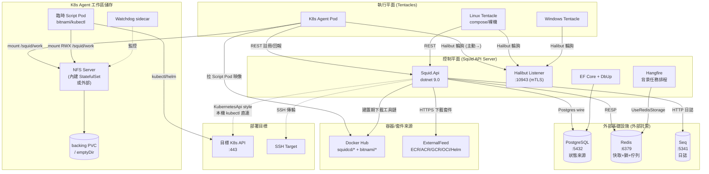

# Squid 部署架構 — 外部依賴與服務間關係映射

> **角色**：External Dependency Mapping Analyst
> **範圍**：Squid API Server、Tentacle（Windows/Linux/K8s Agent）、NFS Server、Watchdog 等所有部署元件。
> **資料來源**：`Dockerfile.*`、`src/*/appsettings*.json`、`deploy/helm/kubernetes-agent/`、`deploy/scripts/`、`deploy/docker/`、`docker/nfs-server/`、`NuGet.Config`、`Directory.Packages.props`/各 `*.csproj`、`src/Squid.Core/Services/Caching/`、`src/Squid.Core/Halibut/`、`src/Squid.Api/Extensions/Hangfire/`。
> **產出日期**：2026-08-14

---

## 0. 執行摘要（TL;DR）

Squid 是一個類 Octopus 的 CD/部署編排系統，採「**Server（控制平面）＋ Tentacle（執行平面）**」雙層架構。其外部依賴可分為三大類：

| 依賴類別 | 主要項目 | 託管模式 | 持有 Squid 狀態？ |
|---|---|---|---|
| **資料持久化** | PostgreSQL（EF Core + DbUp）、Redis（快取 + Hangfire 佇列 + 分散式鎖） | 兩者皆可自託管或外部託管 | ✅ 是（核心狀態） |
| **傳輸 / RPC** | Halibut（mTLS TCP 輪詢，:10943）、目標 K8s API、目標 SSH、外部 Container/Helm Registry | 外部託管（部署目標） | ❌ 否（僅傳輸） |
| **運行時工具鏈** | kubectl、helm、pwsh、AWS CLI、dotnet-script、Docker Hub 映像檔 | 映像檔內嵌（建置期下載） | ❌ 否 |
| **日誌 / 觀測** | Seq（Serilog sink） | 外部託管 | ⚠️ 日誌資料 |
| **套件來源** | Docker Hub、GitHub Releases、NuGet（含私有 HangfirePro） | 外部託管 | ❌ 否 |

**核心降級策略**：Redis 不可用時走「**靜默吞例外 + 回傳預設值**」（`RedisSafeRunner`）；Halibut RPC 不可用時走「**每機器斷路器 fail-fast**」（`MachineCircuitBreaker`）；PostgreSQL 不可用時**無降級**（硬依賴，啟動期 DbUp 即失敗）。

---

## 1. 外部服務依賴總覽

### 1.1 Squid API Server（`Squid.Api`）依賴

來源：`src/Squid.Api/appsettings.json`、`Program.cs`、`SquidModule.cs`。

| 依賴 | 設定鍵 / 來源 | 用途 | 協議 | 方向 |
|---|---|---|---|---|
| **PostgreSQL** | `SquidStore:ConnectionString` | EF Core 持久化（所有實體）+ DbUp schema 遷移 | TCP 5432 (Postgres wire) | Api → PG |
| **Redis** | `RedisCacheConnectionString` | 應用快取、分散式鎖（RedLock）、**Hangfire 任務佇列儲存** | TCP 6379 (RESP) | Api → Redis |
| **Seq** | `Serilog:Seq:ServerUrl` | 結構化日誌彙整 | HTTP (POST `/api/events/raw`) | Api → Seq |
| **Halibut Agent（Tentacle）** | `Halibut:Polling.Port=10943` | 對部署目標下達腳本/RPC | TCP 10943 (Halibut mTLS，Server 為 listener，Agent 輪詢) | Agent → Server（輪詢方向） |
| **目標 K8s API Server** | endpoint JSON（`KubernetesApi` style） | `KubernetesApiExecutionStrategy` 本機 kubectl 直連 | TCP 443 (HTTPS) | Api → K8s API |
| **外部 Container/Helm Registry** | `ExternalFeed.FeedUri`（Docker/ECR/ACR/GCR/OCI/Helm） | 套件下載（`HttpPackageContentFetcher`） | HTTPS | Api → Registry |
| **GitHub / 下載源** | Dockerfile 建置期 | kubectl/helm/pwsh/awscli/dotnet-script 下載 | HTTPS | 建置期 → dl.k8s.io / get.helm.sh / github.com |

> ⚠️ **無獨立「訊息佇列」產品**：Squid 不使用 RabbitMQ/Kafka。背景任務排程以 **Hangfire + Redis 儲存** 實現（`HangfireRegistrarBase` 呼叫 `UseRedisStorage(...)`）。`Hangfire.MemoryStorage` 僅為測試用套件。

### 1.2 Tentacle（執行平面）依賴

來源：`src/Squid.Tentacle/appsettings.json`、`Dockerfile.Tentacle*`、helm `deployment.yaml`。

| 依賴 | 設定鍵 | 用途 | 協議 | 方向 |
|---|---|---|---|---|
| **Squid Server (REST)** | `Tentacle__ServerUrl` | 註冊、回報狀態、拉取組態 | HTTPS (REST) | Tentacle → Server |
| **Squid Server (Halibut)** | `Tentacle__ServerCommsUrl` (:10943) | 接收部署指令（輪詢通道） | TCP 10943 (Halibut mTLS) | Tentacle → Server（輪詢） |
| **K8s API（同叢集）** | in-cluster ServiceAccount token | K8s Agent 建立臨時 Script Pod 執行部署 | TCP 443 (HTTPS) | Tentacle → K8s API |
| **NFS Server** | `workspace.nfs.server` / 內建 NFS | 共享工作區（Script Pod 間檔案傳遞） | TCP 2049 (NFSv4.1) | Tentacle/ScriptPod → NFS |
| **Docker Hub / OCI Registry** | `scriptPod.image=bitnami/kubectl:latest`、`chartRef=oci://registry-1.docker.io/squidcd/kubernetes-agent` | Script Pod 映像、Helm chart | HTTPS | Tentacle → Registry |

### 1.3 NFS Server（sidecar/StatefulSet）依賴

來源：`Dockerfile.NfsServer`、`docker/nfs-server/entrypoint.sh`、helm `nfs-statefulset.yaml`。

| 依賴 | 用途 | 協議 |
|---|---|---|
| 底層 PV / backing PVC（或 `emptyDir`） | 持久化共享檔案的實際儲存 | 區塊/檔案（K8s PV） |
| `rpcbind` / `rpc.nfsd` / `rpc.mountd` | NFS daemon 套件 | TCP/UDP 2049 + rpc 埠 |

---

## 2. 依賴服務的部署方式（自託管 vs 外部託管）

### 2.1 部署矩陣

| 依賴 | 自託管（隨 Squid 部署） | 外部託管（雲端/既有服務） | 判定方式 |
|---|---|---|---|
| **PostgreSQL** | ❌ 不在 compose/helm 中隨附 | ✅ 預期外部提供（`appsettings.json` 連線字串指向 `127.0.0.1`，為開發本機預設） | 無 PgSQL 容器定義於 repo |
| **Redis** | ❌ 不隨附 | ✅ 外部提供（連線字串 `127.0.0.1:6379`，`abortConnect=False`） | 無 Redis 容器定義於 repo |
| **Seq** | ❌ 不隨附 | ✅ 外部提供（`http://localhost:5341`） | 無 Seq 容器定義 |
| **Halibut (Server listener)** | ✅ Api 內建（`HalibutModule`，port 10943） | — | Server 進程內 |
| **NFS Server** | ✅ **可自託管**（helm 內建 StatefulSet，`useBuiltinNfs`） | ✅ **可外部託管**（`workspace.nfs.server` 指定既有 NFS，`useExternalNfs`） | helm helper 三選一 |
| **目標 K8s API / SSH** | — | ✅ 部署目標本身 | endpoint JSON |
| **Container/Helm Registry** | — | ✅ Docker Hub / ECR / ACR / GCR / OCI | `ExternalFeed` 設定 |
| **Script Pod 映像** | — | ✅ Docker Hub（`bitnami/kubectl`） | helm `scriptPod.image` |

### 2.2 NFS 的三種工作區儲存模式（helm `_helpers.tpl`）

```
useCustomPvc  = workspace.storageClassName 或 workspace.volumeName 任一非空 → true
useBuiltinNfs = (非 customPvc) 且 (workspace.nfs.server 為空) → true   # 自託管 NFS StatefulSet
useExternalNfs= (非 customPvc) 且 (workspace.nfs.server 非空) → true    # 接外部 NFS
```

| 模式 | PV 來源 | 適用場景 |
|---|---|---|
| **BuiltinNfs** | `nfs.csi.k8s.io` → 內建 NFS StatefulSet (headless Service, clusterIP: None) | 無既有 RWX 儲存的叢集，一鍵自託管 |
| **ExternalNfs** | `nfs:` PV 指向 `workspace.nfs.server` | 企業已有 NFS/NAS |
| **CustomPVC** | 使用者自帶 storageClass / 預建 PV | 雲端受控 RWX（如 Azure File、Filestore） |

> 當使用 `useCustomPvc` 時，helm **不部署** NFS Server 與 Watchdog sidecar（見 `deployment.yaml` 條件 `and .Values.watchdog.enabled (not useCustomPvc)`）。

### 2.3 映像檔登錄與命名

所有 Squid 自有映像集中於 Docker Hub `squidcd/` 命名空間：

| 映像 | Dockerfile | 用途 |
|---|---|---|
| `squidcd/squid-api`（隱含） | `Dockerfile.Api` | API Server |
| `squidcd/squid-tentacle` | `Dockerfile.Tentacle` | Windows Tentacle（基礎） |
| `squidcd/squid-tentacle-linux` | `Dockerfile.Tentacle.Linux` | Linux Tentacle（compose 用） |
| `squidcd/squid-watchdog` | `Dockerfile.Tentacle.Watchdog` | NFS 工作區看門狗 sidecar |
| `squidcd/nfs-server` | `Dockerfile.NfsServer` | 內建 NFS Server |
| `squidcd/kubernetes-agent`（OCI chart） | helm `chartRef` | K8s Agent helm chart |

第三方映像：`bitnami/kubectl`（Script Pod）、`alpine:3.19`（NFS 基底）、`mcr.microsoft.com/dotnet/{sdk,runtime,aspnet}:9.0`（建置/執行基底）、`jrei/systemd-*`（E2E 升級測試用）。

---

## 3. 服務間通訊協議與方向

### 3.1 通訊協議清單

| 通訊鏈路 | 協議 | 埠 | 方向（誰→誰） | TLS |
|---|---|---|---|---|
| Server ↔ Tentacle (RPC) | **Halibut**（二進位 mTLS，輪詢模式） | 10943 | Tentacle → Server（Tentacle 主動輪詢 `poll://{subscriptionId}/`） | ✅ 雙向 mTLS（自簽憑證 + thumbprint 信任） |
| Tentacle → Server (控制面) | HTTPS REST | 443/7078 | Tentacle → Server | ✅ TLS |
| Server → DB | PostgreSQL wire | 5432 | Server → PG | 視連線字串（`sslmode`） |
| Server → Redis | RESP (TCP) | 6379 | Server → Redis | 視連線字串（`ssl=True/False`） |
| Server → Seq | HTTP | 5341 | Server → Seq | 視 `ServerUrl`（http/https） |
| Server → 目標 K8s (KubernetesApi style) | HTTPS (kube API) | 443 | Server → K8s API | ✅ TLS（可 `SkipTlsVerification`） |
| Server → Container/Helm Registry | HTTPS | 443 | Server → Registry | ✅ TLS |
| Tentacle (K8s Agent) → 同叢集 K8s API | HTTPS (in-cluster SA token) | 443 | Tentacle → K8s API | ✅ TLS |
| Tentacle / ScriptPod → NFS | **NFSv4.1** (TCP) | 2049 | Tentacle/ScriptPod → NFS | ❌ 無（內網） |
| Tentacle → Docker Hub (拉 Script Pod 映像) | HTTPS | 443 | Tentacle → Registry | ✅ TLS |
| Server (Halibut listener) ← K8s LoadBalancer | L4 TCP passthrough | 10943 | 外部 Agent → SLB → Pod | Halibut mTLS（ingress 不終止） |

### 3.2 關鍵：Halibut 輪詢方向的「反向」

與直覺相反，**Server 是 listener（被動），Tentacle 是主動撥號方**。即使 Server 在 K8s 叢集內，外部 Tentacle 仍可透過 `poll://` URI 由 Tentacle 主動建立長連線輪詢。這是 Squid/Octopus 處理 NAT/防火牆的核心設計（見 CLAUDE.md §「Kubernetes Deployment — Exposing Halibut Polling」）。

Server 端需兩個獨立對外端點（**不可合併為單一 Ingress**）：
- **Web/API**：L7 HTTP，經 nginx-ingress 終止 TLS。
- **Halibut 輪詢**：L4 TCP LoadBalancer 直通 Pod:10943，Halibut 自帶 mTLS，ingress 不介入。

---

## 4. 依賴健康與可用性（降級 / 斷路器策略）

### 4.1 PostgreSQL — 硬依賴，無降級

- **啟動期**：`Program.cs` 於 host 啟動前同步執行 `DbUpRunner(connection).Run()`，DB 不可用即**啟動失敗**。
- **運行期**：EF Core 直接查寫，無重試/斷路器包裝（依賴 Npgsql 連線池與連線字串重連）。
- **結論**：PG 為**不可降級的硬依賴**；其可用性等同 Squid 可用性。

### 4.2 Redis — 軟依賴，靜默降級

來源：`RedisSafeRunner`、`RedisConnectionPool`、連線字串 `abortConnect=False`。

| 失敗情境 | 行為 | 訊號 |
|---|---|---|
| Redis 完全不可用 | `RedisSafeRunner` **catch 所有例外 → 記 Log.Error → 回傳 `default`/空集合** | 靜默（不拋出） |
| 讀/寫操作失敗 | 同上，回傳 `default(T)` / `new List<T>()` | 靜默 |
| 分散式鎖取得失敗（**基礎設施**問題） | 拋 `LockAcquireFailedException`（1.6.x audit 修正：不再偽裝成競爭） | **拋出**（明確） |
| 分散式鎖競爭（他人持有） | 回傳 `default(T)` | 靜默（競爭語意） |
| 鎖內 logic 拋例外 | **例外向上傳播**（修正：不再吞掉，避免掩蓋升級策略失敗） | **拋出** |

- 連線池：每 Redis server 預先建立 **10 條** `ConnectionMultiplexer`，隨機取用。
- 連線字串含 `abortConnect=False`（首次連不上不立即失敗）、`syncTimeout=50000`、`allowAdmin=true`。
- **隱含風險**：Hangfire 亦用同一 Redis 做任務佇列儲存（`UseRedisStorage`）。Redis 不可用時，`RedisSafeRunner` 的靜默降級保護的是「應用快取/鎖」呼叫；**Hangfire 自身的儲存連線不在 SafeRunner 內**，故背景任務排程會直接失敗。此為降級策略的邊界。

### 4.3 Halibut RPC（Server→Tentacle）— 斷路器 fail-fast

來源：`src/Squid.Core/Halibut/Resilience/`、`HalibutSetting.CircuitBreaker`。

| 機制 | 設定（預設） | 來源 |
|---|---|---|
| **每機器斷路器** | 連續 `FailureThreshold=3` 次傳輸失敗 → 開啟 | `MachineCircuitBreakerRegistry` |
| **開啟時長** | `OpenDurationSeconds=60`（fail-fast，拒絕 RPC） | `CircuitBreakerSettings` |
| **暫態失敗分類** | `TransientFailureClassifier` 區分可重試 vs 永久失敗 | `Halibut/Resilience/` |
| **觀測退避** | `ObserverSettings`：初始 1s、上限 10s、backoff 1.5× | `GetStatus` 輪詢 |
| **活性探測** | `LivenessSettings`：每 5s 探測、逾時 3s、連續 2 次失敗標記不可達 | 腳本執行期間 |
| **腳本逾時** | `Polling.ScriptTimeoutMinutes=30` | 輪詢觀測上限 |
| **RPC 重試策略** | `MachinePolicy.MachineRpcCallRetryPolicy`（可每機器覆寫） | `MachinePolicyDto` |

> Tentacle 端對 K8s API 操作另有 Polly 重試：`ResilientKubernetesPodOperations`（`RetryPolicy`）。

### 4.4 外部 Container/Helm Registry — 警告降級

`HttpPackageContentFetcher.FetchAsync`：
- 下載失敗（非 2xx / 例外）→ **不拋出**，回傳 `PackageFetchResult(空檔案, warnings, 空 bytes)`。
- 上層 `PackageAcquisitionService` 若收到**空內容** → 拋 `InvalidOperationException`（部署任務失敗）。
- Helm chart：`index.yaml` 取不到時 fallback 到慣例 URL，僅記 Warning。

### 4.5 Seq（日誌）— best-effort

Serilog Seq sink 為非同步批次；Seq 不可用時日誌丟失但不影響主流程（無降級配置，依賴 sink 內部緩衝/丟棄）。

### 4.6 NFS / 工作區儲存 — Watchdog 守護

- `Squid.Tentacle.Watchdog`（`WATCHDOG_DIRECTORY=/squid/work`，預設 5s 循環、10s 逾時）監控 NFS 掛載點健康。
- NFS 掛載選項含 `soft, timeo=50, retrans=4, lookupcache=none`：**軟掛載**，逾時後回 I/O 錯誤而非無限掛死（避免部署卡死）。
- 僅在 `useBuiltinNfs`/`useExternalNfs`（非 customPvc）時部署 Watchdog sidecar。

### 4.7 降級策略總表

| 依賴 | 降級等級 | 策略 | 影響 |
|---|---|---|---|
| PostgreSQL | ❌ 無降級 | 啟動即失敗 / 運行期拋例外 | 系統不可用 |
| Redis（快取/鎖） | ✅ 軟降級 | 靜默吞例外、回傳預設 | 快取失效、鎖失效（可能併發） |
| Redis（Hangfire） | ⚠️ 半降級 | 非 SafeRunner 範圍，直接失敗 | 背景任務不執行 |
| Halibut RPC | ✅ 斷路器 | fail-fast 60s + 每機器隔離 | 該機器部署失敗，不影響其他 |
| 外部 Registry | ⚠️ 任務失敗 | Warning + 空內容 → 上層拋 | 該部署任務失敗 |
| Seq | ✅ best-effort | 丟棄日誌 | 僅觀測性下降 |
| NFS | ✅ Watchdog + soft mount | 軟掛載 I/O 錯誤 + sidecar 監控 | 該 Tentacle 工作區失效 |

---

## 5. 資料持久化依賴（誰持有 Squid 狀態）

| 持久化層 | 載體 | 持有的狀態 | 持久性 |
|---|---|---|---|
| **PostgreSQL** | `SquidStore:ConnectionString` | **所有業務狀態**：Project、Deployment、Release、DeploymentProcess、Machine、DeploymentAccount、ExternalFeed、ServerTask、Variables、Events、MachinePolicy…（EF Core 實體 + DbUp 遷移指令碼） | ✅ 真實來源（source of truth） |
| **Redis** | `RedisCacheConnectionString` | 應用快取、分散式鎖、**Hangfire 佇列與任務狀態**（`WithJobExpirationTimeout(0.5d)`） | ⚠️ 快取可重建；Hangfire 任務佇列為**半持久**（遺失=未執行的背景任務消失） |
| **NFS 工作區** | `workspace.nfs` / PV | Tentacle **部署工作區**：套件解壓、暫存腳本、Calamari 套件、部署產物；Script Pod 間共享檔案 | 🔶 部署期暫存（非長期狀態，但跨 Pod 共享） |
| **Tentacle 憑證** | `tentacle-certs` volume / `/squid/certs` | Halibut client 憑證 + thumbprint | ✅ 長期（身分憑證） |
| **Calamari 套件快取** | Api: 進程內/暫存目錄；Tentacle: `/squid/bin` | 部署工具執行檔 | 🔶 可重新下載 |
| **套件暫存** | `Path.GetTempPath()/squid-packages/{deploymentId}` | 從 Registry 下載的 `.nupkg` | 🔶 部署期暫存 |
| **`last-upgrade.json`** | Tentacle 本機 | 最後一次升級記錄（升級流程狀態） | ✅ 長期（升級冪等性） |

> **無物件儲存（S3/MinIO）依賴**：套件與產物目前存於本機暫存目錄與 NFS，未接外部物件儲存。

---

## 6. NFS Server 角色分析

### 6.1 角色定位

NFS 在 Squid K8s Agent 架構中扮演**「跨 Pod 共享工作區」**的儲存層，解決「K8s Agent 建立的臨時 Script Pod 需要與 Agent 共享部署檔案」的問題。它**不是** Squid Server 的依賴，而是**K8s Tentacle（Script Pod 模式）的依賴**。

### 6.2 為何需要 NFS

- K8s Agent 收到部署指令後，會建立**臨時 Script Pod**（`scriptPod.image=bitnami/kubectl`）執行 `kubectl apply` / `helm upgrade` / bash。
- Agent 需將「套件解壓後的 YAML / 腳本檔案」傳遞給 Script Pod。
- 透過 **RWX（ReadWriteMany）NFS 掛載**，Agent 與 Script Pod 共享 `/squid/work`，免去逐檔複製。

### 6.3 NFS 部署型態

| 型態 | 觸發條件 | 元件 |
|---|---|---|
| **內建 NFS Server**（自託管） | `useBuiltinNfs`（無 customPvc、無外部 nfs.server） | `nfs-statefulset.yaml`（`squidcd/nfs-server`，privileged，埠 2049）+ `nfs-service.yaml`（headless, clusterIP: None）+ `pv.yaml`（`nfs.csi.k8s.io`）+ 可選 `nfs-backing-pvc.yaml` |
| **外部 NFS**（外部託管） | `useExternalNfs`（`workspace.nfs.server` 非空） | 僅 `pv.yaml`（`nfs:` driver 指向外部 server），不部署 StatefulSet |
| **自訂 PVC**（無 NFS） | `useCustomPvc`（有 storageClass/volumeName） | 純 PVC，無 NFS、無 Watchdog sidecar |

### 6.4 NFS 依賴關係

```
                        ┌──────────────── K8s API (建 Pod) ─────────────┐
                        │                                                  │
K8s Agent Pod ──mount──►│ /squid/work  ◄──NFSv4.1──►  NFS Server (內建/外部)
   │                     │ /squid/work                      │
   │ creates             │                                  └─► backing PVC / emptyDir
   ▼                     │
Script Pod ──mount──────►│ /squid/work  (RWX，共享檔案)
```

- **NFS Server 自身依賴**：`alpine:3.19` + `nfs-utils` + `rpcbind`/`rpc.nfsd`/`rpc.mountd`；需 `securityContext.privileged: true`；底層需 backing PV（或 `emptyDir`，後者 Pod 重啟即失資料）。
- **掛載選項**（`values.yaml`）：`nfsvers=4.1, soft, timeo=50, retrans=4, lookupcache=none` — 軟掛載避免 I/O 卡死。
- **Watchdog**：`nfs-watchdog` sidecar（`readOnly` 掛載 `/squid/work`）監控掛載點，僅於非 customPvc 時存在。

### 6.5 NFS 失效影響

| 失效 | 影響 |
|---|---|
| NFS Server Pod 當機（內建模式） | StatefulSet 重啟；`emptyDir` backing 會遺失工作區； backing PVC 則保留 |
| NFS 網路不可達 | `soft` 掛載 → I/O 錯誤 → 該 Tentacle 部署失敗（不影響其他 Tentacle） |
| 掛載點 stale | Watchdog 偵測並可觸發重啟 |

---

## 7. 依賴版本管理策略

### 7.1 .NET / NuGet 套件（集中於各 `*.csproj`，無中央 `Directory.Packages.props`）

| 套件 | 版本 | 角色 |
|---|---|---|
| `Halibut` | **8.1.1943** | RPC 核心（版本敏感，見 CLAUDE.md Halibut 8.x API notes） |
| `Npgsql.EntityFrameworkCore.PostgreSQL` | 9.0.2 | PostgreSQL EF Core provider |
| `dbup-postgresql` | 5.0.40 | schema 遷移 |
| `StackExchange.Redis` | 2.8.58 | Redis client |
| `Hangfire` | 1.8.3 | 背景任務 |
| `Hangfire.Pro.Redis` | 3.0.0 | Hangfire Redis 儲存（**私有付費源** `nuget.hangfire.io`） |
| `RedLock.net` | 2.3.2 | 分散式鎖 |
| `KubernetesClient` | 15.0.1 | K8s API client |
| `SSH.NET` | 2025.1.0 | SSH 傳輸 |
| `Polly` | 8.6.6 | 重試/斷路器 |
| `Microsoft.EntityFrameworkCore` | 9.0.6 | EF Core |
| `AutoMapper` | 13.0.1 | 物件對應 |
| `Serilog.Sinks.Seq` | 8.0.0 | Seq 日誌 sink |
| `YamlDotNet` | 16.3.0 | YAML 處理 |

**NuGet 源**（`NuGet.Config`）：
- `NuGet.org v3`（公開）
- `HangfirePro`（**私有，含明文帳密** `ProtonTechnology` — ⚠️ 安全風險，已提交入 repo）
- `SJ.Nuget`（私有，**已停用** `disabled=true`）

> ⚠️ `NuGet.Config` 內含明文密碼，為應移除的敏感資料。

### 7.2 映像檔 / 二進位版本固定

| 項目 | 固定策略 | 風險 |
|---|---|---|
| `.NET SDK/Runtime` | `9.0`（浮動 minor） | 低（官方基底） |
| `alpine:3.19` | minor 固定 | 低 |
| `kubectl`（Api/Tentacle 映像內） | **`stable.txt`（每次建置拉最新）** | ⚠️ 未 pin 版本 |
| `helm`（映像內） | **GitHub latest release** | ⚠️ 未 pin 版本 |
| `pwsh`（Api 映像內） | **GitHub latest** | ⚠️ 未 pin 版本 |
| `aws-cli`（Api 映像內） | **latest** | ⚠️ 未 pin 版本 |
| `bitnami/kubectl`（Script Pod） | **`:latest`**（helm 預設） | ⚠️ 高風險；`ScriptPodImageValidator` 預設 Warn 模式，可設 `SQUID_SCRIPT_POD_IMAGE_ENFORCEMENT=strict` 強制 digest pin |
| Squid 自有映像 | helm `tag` 預設取 `Chart.AppVersion`（GitVersion 產出） | ✅ 版本隨 release |
| `chartRef`（K8s Agent helm chart） | `oci://registry-1.docker.io/squidcd/kubernetes-agent` | ⚠️ 未 pin tag |

**版本產出**：`GitVersion.yml`（`ContinuousDelivery`，main branch `tag-prefix=[vV]?`）→ CI（`build-api-docker.yml`）以 `fullSemVer` 產出映像 tag。

### 7.3 Tentacle 安裝版本

`install-tentacle.sh` 支援 `--version` pin；預設 `latest` 走 GitHub Releases redirect。優先嘗試 **APT/RPM 私有簽章 repo**（`squid-tentacle.repo`），失敗才 fallback 直連 GitHub Releases。

---

## 8. 依賴關係圖

### 8.1 整體架構（Mermaid）



### 8.2 通訊協議與方向（ASCII）

```
┌──────────────────────────────────────────────────────────────────────┐
│                        Squid API Server (Pod)                        │
│  ┌─────────┐  ┌──────────┐  ┌──────────┐  ┌───────────────────────┐  │
│  │ Web/API │  │ Hangfire │  │ EF Core  │  │ Halibut Listener      │  │
│  │ :8080   │  │ (bg jobs)│  │ +DbUp    │  │ :10943 (mTLS, passive)│  │
│  └────┬────┘  └────┬─────┘  └────┬─────┘  └──────────▲────────────┘  │
│       │ HTTPS      │ RESP        │ PG wire            │ Halibut       │
└───────┼────────────┼─────────────┼────────────────────┼───────────────┘
        │            │             │                    │ TCP 10943
        ▼            ▼             ▼                    │ (Tentacle 主動輪詢 poll://)
      [Seq]       [Redis]      [PostgreSQL]            │
      :5341      :6379         :5432                   │
       日誌      快取/鎖/佇列    狀態來源                │
                                                     │
        ┌────────────────────────────────────────────┘
        │  (反向: Tentacle → Server，穿透 NAT)
        ▼
┌─────────────────── Tentacle 執行平面 ───────────────────────────────┐
│                                                                     │
│  Windows Tentacle        Linux Tentacle           K8s Agent Pod     │
│  (服務/SCM)              (systemd/compose)        ┌──────────────┐  │
│                                                ┌─► Script Pod   │  │
│                                                │ │ bitnami/kubectl│ │
│                          ┌──────────────────┐  │ └───────┬──────┘  │
│                          │ NFS Server       │◄─┤         │ kubectl │
│                          │ :2049 (NFSv4.1)  │◄─┤ mount    ▼        │
│                          │ 內建/外部        │  │  [目標 K8s API :443]│
│                          └────────┬─────────┘  │                    │
│                          backing PVC/emptyDir   └──────────────────┘ │
│                          + Watchdog sidecar                         │
└─────────────────────────────────────────────────────────────────────┘

        另有: API Server (KubernetesApi style) ──本機 kubectl──► 目標 K8s API :443
              API Server ──HTTPS──► ExternalFeed (ECR/ACR/GCR/OCI/Helm) 拉套件
```

### 8.3 持久化與降級責任分層

```
持久化層                    降級策略                     失效影響
────────────────────────────────────────────────────────────────────
PostgreSQL (source of truth)  ❌ 無降級 (DbUp 啟動即檢查)   系統不可用
        │
        │ 業務實體 (Project/Deployment/Machine/ServerTask/Variables...)
        ▼
Redis (cache + lock + Hangfire queue)
        ├─ 應用快取/鎖  → RedisSafeRunner 靜默吞例外      快取 miss、鎖失效
        └─ Hangfire 佇列 → 不在 SafeRunner，直接失敗      背景任務停擺

NFS 工作區 (Tentacle 共享)     Watchdog + soft mount        該 Tentacle 部署失敗

Halibut RPC (傳輸)            每機器斷路器 fail-fast 60s   該機器隔離，其他不受影響
```

---

## 9. 風險與建議

| # | 風險 | 嚴重度 | 建議 |
|---|---|---|---|
| R1 | `NuGet.Config` 內含 HangfirePro **明文帳密**已入 repo | 🔴 高 | 移至 CI secret / NuGet credential provider；輪換密碼 |
| R2 | Dockerfile 建置期 kubectl/helm/pwsh/awscli **拉 latest**，無 reproducible build | 🟡 中 | pin 具體版本（`KUBECTL_VERSION=v1.29.x`） |
| R3 | `scriptPod.image=bitnami/kubectl:latest` 預設未 pin digest | 🟡 中 | 生產設 `SQUID_SCRIPT_POD_IMAGE_ENFORCEMENT=strict` + digest |
| R4 | Hangfire Redis 連線不受 `RedisSafeRunner` 保護；Redis 全斷時背景任務直接失敗 | 🟡 中 | 文件化「Redis 為半硬依賴」；考慮 Hangfire 重試或 PG 儲存 fallback |
| R5 | `appsettings.json` 提交 SelfCert **Base64 私鑰**（`Password=squid`） | 🔴 高 | 生產必須以 secret 覆寫；開發憑證應標示明顯警告 |
| R6 | `VariableEncryption.MasterKey` 提交空字串（E2E 提交隨機 key） | 🟡 中 | 維持 STRICT 強制（已實作）；確保生產必設 |
| R7 | 內建 NFS backing 採 `emptyDir`（未設 backingVolume.storageClassName 時）→ Pod 重啟失工作區 | 🟡 中 | 文件建議生產必設 `workspace.nfs.backingVolume.storageClassName` |
| R8 | 無獨立訊息佇列；Hangfire+Redis 同時承擔快取與任務儲存，故障域重疊 | 🟡 中 | 評估任務儲存獨立（另一 Redis 實例或 PG-backed Hangfire） |
| R9 | APT/RPM repo（`squid-tentacle.repo`）與 GitHub Releases 雙通道，版本一致性需確保 | 🟢 低 | CI 應同步發布兩通道並驗證 |

---

## 10. 結論

Squid 的外部依賴架構清晰且分層明確：

1. **狀態層**（PostgreSQL + Redis）為外部託管的硬/半硬依賴，其中 PostgreSQL 無降級空間、Redis 採靜默降級但有 Hangfire 邊界。
2. **傳輸層**（Halibut mTLS 輪詢）以「Tentacle 主動撥號 + 每機器斷路器」兼顧 NAT 穿透與故障隔離。
3. **執行層**（Tentacle + Script Pod + NFS）以 NFS RWX 共享工作區，配 Watchdog 與 soft mount 保障可用性，且 NFS 支援自託管/外部/自訂 PVC 三模式，部署彈性高。
4. **運行時工具鏈**以映像檔內嵌為主，但版本固定鬆散（多處 `latest`），為主要可改善項。
5. **NFS 角色**明確為「K8s Agent Script Pod 的跨 Pod 共享工作區儲存」，非 Server 依賴，且可被外部 NFS 或自訂 RWX PVC 取代。

最需優先處理者為 **R1（NuGet 明文密碼）** 與 **R5（提交的 SelfCert 私鑰）** 兩項安全風險。
